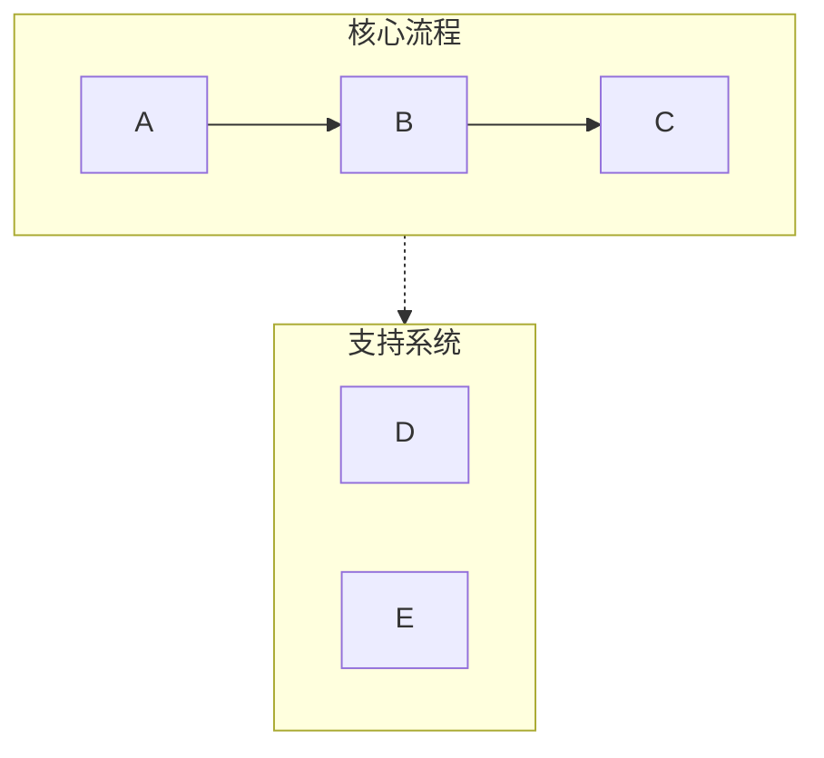
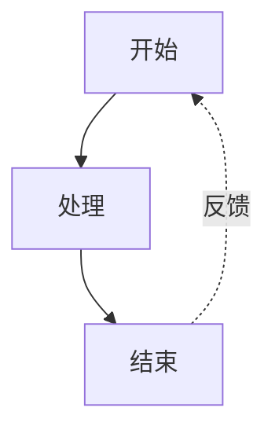
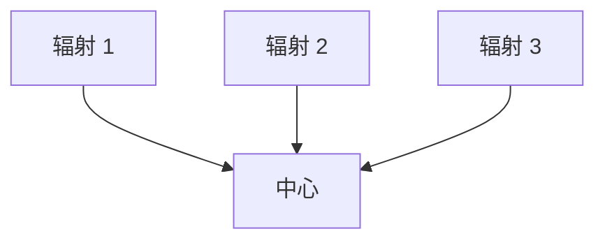

# Mermaid 可视化工具

## 概述

将文本内容转换为简洁、专业的Mermaid图表，优化用于演示和文档。自动处理常见语法陷阱（列表语法冲突、子图命名、间距问题），确保图表在Obsidian、GitHub和其他兼容Mermaid的平台上正确渲染。

## 快速开始

创建Mermaid图表时：

1. **分析内容** - 识别关键概念、关系和流程
2. **选择图表类型** - 选择最合适的可视化类型（见下方图表类型）
3. **选择配置** - 确定布局、详细程度和样式
4. **生成图表** - 创建语法正确的Mermaid代码
5. **以Markdown格式输出** - 用适当的代码块包裹，可附加解释说明

**默认假设：**
- 垂直布局（TB），除非明确要求水平布局
- 中等详细程度（简洁性与信息量平衡）
- 专业配色方案，使用语义化颜色
- 兼容Obsidian/GitHub的语法

## 图表类型

### 1. 流程图表（graph TB/LR）
**最适合：** 工作流、决策树、顺序流程、AI智能体架构

**使用场景：** 内容描述步骤、阶段或一系列动作

**关键特性：**
- 通过子图实现泳道，用于分组相关步骤
- 箭头标签表示转换
- 反馈循环和分支
- 颜色编码的阶段

**配置选项：**
- `layout`: "vertical" (TB), "horizontal" (LR)
- `detail`: "simple" (仅核心步骤), "standard" (含描述), "detailed" (含注释)
- `style`: "minimal", "professional", "colorful"

### 2. 循环流程图（graph TD with circular layout）
**最适合：** 循环过程、持续改进循环、智能体反馈系统

**使用场景：** 内容强调迭代、反馈或循环关系

**关键特性：**
- 中心枢纽与辐射元素
- 弯曲的反馈箭头
- 清晰的循环指示器

### 3. 比较图表（graph TB with parallel paths）
**最适合：** 前后对比、A vs B分析、传统与现代系统比较

**使用场景：** 内容对比两种或多种方法或系统

**关键特性：**
- 并排布局
- 中央比较节点
- 通过颜色/样式清晰区分

### 4. 思维导图
**最适合：** 层次化概念、知识组织、主题分解

**使用场景：** 内容具有清晰的父子层次关系

**关键特性：**
- 径向树状结构
- 多级嵌套
- 清晰的视觉层次

### 5. 序列图
**最适合：** 组件间交互、API调用、消息流

**使用场景：** 内容涉及参与者/系统随时间进行的通信

**关键特性：**
- 基于时间线的布局
- 清晰的参与者分离
- 过程激活框

### 6. 状态图
**最适合：** 系统状态、状态转换、生命周期阶段

**使用场景：** 内容描述状态及其间的转换

**关键特性：**
- 清晰的状态节点
- 带标签的转换
- 起始和结束状态

## 关键语法规则

**始终遵循这些规则以防止解析错误：**

### 规则 1：避免列表语法冲突
```
❌ 错误: [1. Perception]       → 触发 "Unsupported markdown: list"
✅ 正确: [1.Perception]         → 移除句点后的空格
✅ 正确: [① Perception]         → 使用带圈数字 (①②③④⑤⑥⑦⑧⑨⑩)
✅ 正确: [(1) Perception]       → 使用括号
✅ 正确: [Step 1: Perception]   → 使用 "Step" 前缀
```

### 规则 2：子图命名
```
❌ 错误: subgraph AI Agent Core  → 名称中有空格但未加引号
✅ 正确: subgraph agent["AI Agent Core"]  → 使用ID并附带显示名称
✅ 正确: subgraph agent          → 仅使用简单ID
```

### 规则 3：节点引用
```
❌ 错误: Title --> AI Agent Core  → 直接引用显示名称
✅ 正确: Title --> agent          → 引用子图ID
```

### 规则 4：节点文本中的特殊字符
```
✅ 对包含空格的文本使用引号: ["Text with spaces"]
✅ 转义或避免：引号 → 使用『』代替
✅ 转义或避免：括号 → 使用「」代替
✅ 仅在圆形节点中换行: ((Text<br/>Break))
```

### 规则 5：箭头类型
- `-->` 实线箭头
- `-.->` 虚线箭头（用于支持系统、可选路径）
- `==>` 粗箭头（用于强调）
- `~~~` 不可见链接（仅用于布局）

完整语法参考和边缘情况，请参阅 [references/syntax-rules.md](references/syntax-rules.md)

## 配置选项

所有图表都接受以下参数：

**布局：**
- `direction`: "vertical" (TB), "horizontal" (LR), "right-to-left" (RL), "bottom-to-top" (BT)
- `aspect`: "portrait" (默认), "landscape" (宽屏), "square"

**详细程度：**
- `simple`: 仅核心元素，最小化标签
- `standard`: 平衡的细节与关键描述（默认）
- `detailed`: 完整的注释、解释和元数据
- `presentation`: 为幻灯片优化（更大的文本，更少的细节）

**样式：**
- `minimal`: 单色，简洁线条
- `professional`: 语义化颜色，清晰的层次结构（默认）
- `colorful`: 鲜艳的颜色，高对比度
- `academic`: 用于论文/文档的正式样式

**附加选项：**
- `show_legend`: true/false - 包含颜色/符号图例
- `numbered`: true/false - 为步骤添加序号
- `title`: string - 添加图表标题

## 示例使用模式

**模式 1：基本请求**
```
用户: "可视化软件开发生命周期"
响应: [分析 → 选择 graph TB → 以标准详细程度生成]
```

**模式 2：带配置的请求**
```
用户: "创建我们销售流程的水平流程图，需要大量细节"
响应: [分析 → 选择 graph LR → 以详细程度生成]
```

**模式 3：比较**
```
用户: "比较传统AI与AI智能体"
响应: [分析 → 选择比较布局 → 以对比样式生成]
```

## 工作流程

1. **理解内容**
   - 识别主要概念、实体和关系
   - 确定层次结构或顺序
   - 注意任何比较或对比

2. **选择图表类型**
   - 将内容结构与图表类型匹配
   - 考虑用户的演示上下文
   - 如果不明确，默认使用流程图表

3. **选择配置**
   - 应用用户指定的选项
   - 对未指定的选项使用合理的默认值
   - 优化可读性

4. **生成Mermaid代码**
   - 严格遵守所有语法规则
   - 使用语义化命名（描述性ID）
   - 应用一致的样式
   - 测试常见错误：
     * 节点文本中没有 "数字. 空格" 模式
     * 所有子图使用 ID["显示名称"] 格式
     * 所有节点引用使用ID而非显示名称

5. **输出并附带上下文**
   - 用 ```mermaid 代码块包裹
   - 添加图表结构的简要说明
   - 提及渲染兼容性（Obsidian、GitHub等）
   - 提供调整或创建变体的选项

## 配色方案默认值

标准专业调色板：
- 绿色 (#d3f9d8/#2f9e44): 输入、感知、起始状态
- 红色 (#ffe3e3/#c92a2a): 规划、决策点
- 紫色 (#e5dbff/#5f3dc4): 处理、推理
- 橙色 (#ffe8cc/#d9480f): 动作、工具使用
- 青色 (#c5f6fa/#0c8599): 输出、执行、结果
- 黄色 (#fff4e6/#e67700): 存储、记忆、数据
- 粉色 (#f3d9fa/#862e9c): 学习、优化
- 蓝色 (#e7f5ff/#1971c2): 元数据、定义、标题
- 灰色 (#f8f9fa/#868e96): 中性元素、传统系统

## 常见模式

### 泳道模式（分组）


### 反馈循环模式


### 中心辐射模式


## 质量检查清单

输出前，请验证：
- [ ] 任何节点文本中没有 "数字. 空格" 模式
- [ ] 所有子图使用正确的ID语法
- [ ] 所有箭头使用正确的语法 (-->, -.->)
- [ ] 颜色应用一致
- [ ] 指定了布局方向
- [ ] 存在样式声明
- [ ] 没有模糊的节点引用
- [ ] 兼容Obsidian/GitHub渲染器
- [ ] **任何节点文本中都没有Emoji** - 使用文本标签或颜色编码代替

## 参考

详细语法规则和故障排除，请参阅：
- [references/syntax-rules.md](references/syntax-rules.md) - 完整的语法参考和错误预防