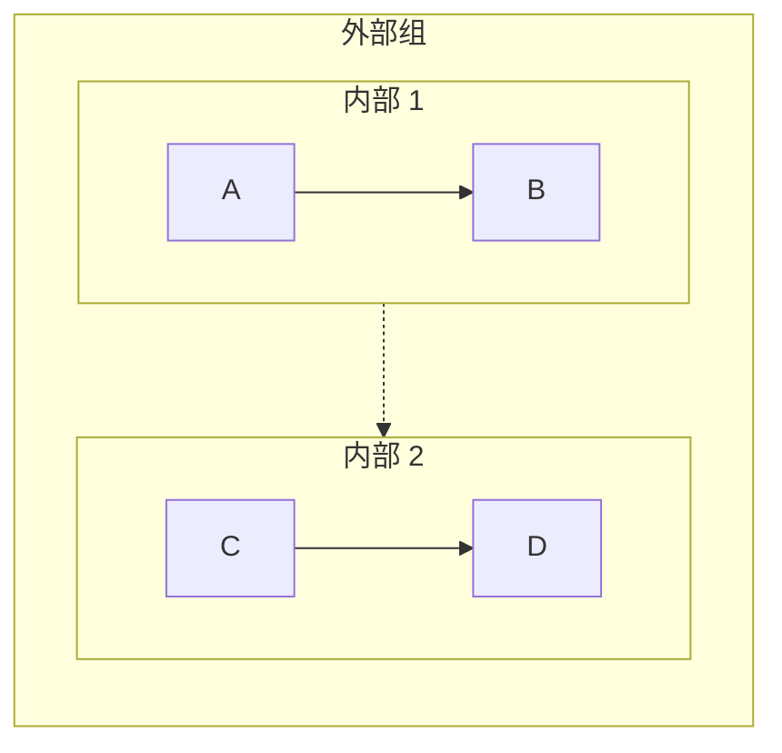
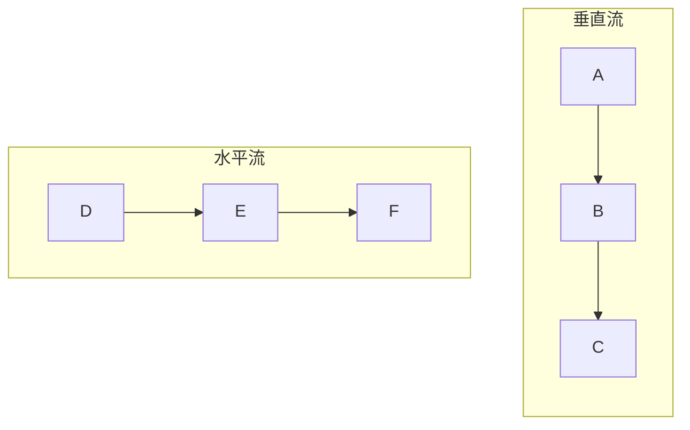
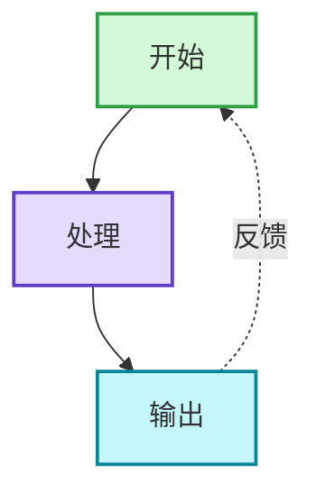
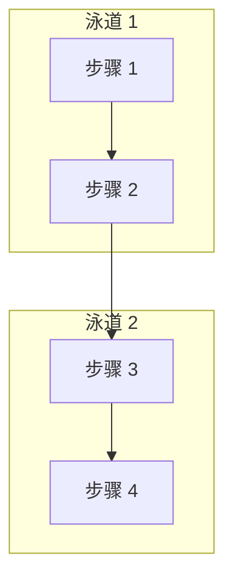
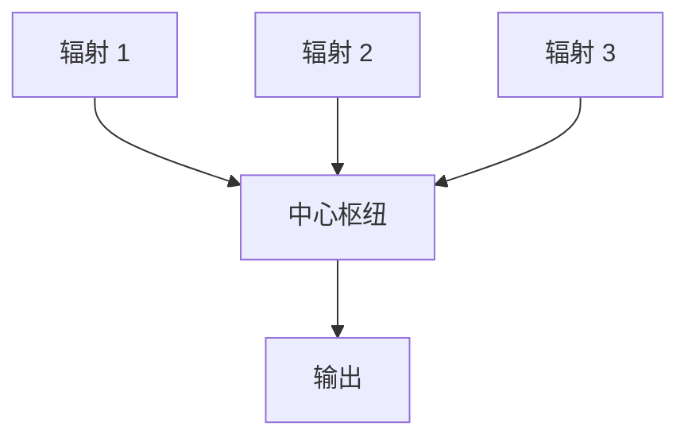

# Mermaid 语法规则参考

本参考提供 Mermaid 图表的全面语法规则和错误预防策略。在遇到语法错误或需要详细语法信息时加载此文档。

## 目录

1. [关键错误预防](#关键错误预防)
2. [节点语法](#节点语法)
3. [子图语法](#子图语法)
4. [箭头和连接类型](#箭头和连接类型)
5. [样式和颜色](#样式和颜色)
6. [布局和方向](#布局和方向)
7. [高级模式](#高级模式)
8. [故障排除](#故障排除)

## 关键错误预防

### 列表语法冲突（最常见错误）

**问题：** Mermaid 解析器将 `数字. 空格` 解释为 Markdown 有序列表语法。

**错误信息：** `Parse error: Unsupported markdown: list`

**解决方案：**

```mermaid
❌ [1. 感知]
❌ [2. 规划]
❌ [3. 推理]

✅ [1.感知]           # 移除空格
✅ [① 感知]           # 使用带圈数字
✅ [(1) 感知]         # 使用括号
✅ [步骤 1: 感知]     # 使用前缀
✅ [步骤 1 - 感知]    # 使用破折号
✅ [感知]             # 移除编号
```

**带圈数字参考：**
```
① ② ③ ④ ⑤ ⑥ ⑦ ⑧ ⑨ ⑩ ⑪ ⑫ ⑬ ⑭ ⑮ ⑯ ⑰ ⑱ ⑲ ⑳
```

### 子图命名规则

**规则：** 包含空格的子图必须使用 ID + 显示名称格式。

```mermaid
❌ subgraph 核心流程
     A --> B
   end

✅ subgraph core["核心流程"]
     A --> B
   end

✅ subgraph core_process
     A --> B
   end
```

**引用子图：**
```mermaid
❌ 标题 --> 核心流程      # 无法引用显示名称
✅ 标题 --> core              # 必须引用 ID
```

### 节点引用规则

**规则：** 始终通过 ID 引用节点，切勿通过显示文本引用。

```mermaid
# 定义节点
A[显示文本 A]
B["显示文本 B"]

# 引用节点
A --> B                        ✅ 使用节点 ID
显示文本 A --> 显示文本 B  ❌ 不能使用显示文本
```

## 节点语法

### 基本节点类型

```mermaid
# 矩形（默认）
A[矩形文本]

# 圆角矩形
B(圆角文本)

# 体育场形
C([体育场形文本])

# 圆形
D((圆形<br/>文本))

# 不对称形状
E>右箭头]

# 菱形（决策）
F{决策?}

# 六边形
G{{六边形}}

# 平行四边形
H[/平行四边形/]

# 数据库
I[(数据库)]

# 梯形
J[/梯形\]
```

### 节点文本规则

**换行：**
- `<br/>` 仅在圆形节点中有效：`((文本<br/>换行))`
- 对于其他节点，使用单独的注释节点或保持文本简洁

**特殊字符：**
- 空格：如果需要，使用引号：`["带空格的文本"]`
- 引号：替换为『』或避免使用
- 括号：替换为「」或避免使用
- 冒号：通常安全，但如果引起问题则避免使用
- 连字符/破折号：安全使用

**长度指南：**
- 保持节点文本少于 50 个字符
- 对于较长内容，使用多行（圆形节点）或单独的注释节点
- 如果文本过长，考虑拆分为多个节点

## 子图语法

### 基本结构

```mermaid
graph TB
    # 带有 ID 和显示名称的正确格式
    subgraph id["显示名称"]
        direction TB
        A --> B
    end
    
    # 仅简单 ID（无空格）
    subgraph simple
        C --> D
    end
    
    # 可以在子图内设置方向
    subgraph horiz["水平"]
        direction LR
        E --> F
    end
```

### 嵌套子图



**限制：** 为保持可读性，嵌套最多 2 层。

### 连接子图

```mermaid
graph TB
    subgraph g1["组 1"]
        A[节点 A]
    end
    
    subgraph g2["组 2"]
        B[节点 B]
    end
    
    # 连接单个节点（推荐）
    A --> B
    
    # 连接子图（创建仅用于布局的不可见链接）
    g1 -.-> g2
```

## 箭头和连接类型

### 基本箭头

```mermaid
A --> B          # 实线箭头
A -.-> B         # 虚线箭头
A ==> B          # 粗箭头
A ~~~> B         # 不可见链接（仅用于布局，不渲染）
```

### 箭头标签

```mermaid
A -->|标签文本| B
A -.->|可选| B
A ==>|重要| B
```

### 多目标连接

```mermaid
# 一对多
A --> B & C & D

# 多对一
A & B & C --> D

# 链式连接
A --> B --> C --> D
```

### 双向连接

```mermaid
A <--> B         # 双向实线
A <-.-> B        # 双向虚线
```

## 样式和颜色

### 内联样式

```mermaid
style NodeID fill:#color,stroke:#color,stroke-width:2px
```

### 颜色格式

- 十六进制颜色：`#ff0000` 或 `#f00`
- RGB：`rgb(255,0,0)`
- 颜色名称：`red`、`blue` 等（支持有限）

### 常见样式模式

```mermaid
# 专业外观
style A fill:#d3f9d8,stroke:#2f9e44,stroke-width:2px

# 强调
style B fill:#ffe3e3,stroke:#c92a2a,stroke-width:3px

# 柔和/次要
style C fill:#f8f9fa,stroke:#dee2e6,stroke-width:1px

# 标题/页眉
style D fill:#1971c2,stroke:#1971c2,stroke-width:3px,color:#ffffff
```

### 样式化多个节点

```mermaid
# 将相同样式应用于多个节点
style A,B,C fill:#d3f9d8,stroke:#2f9e44,stroke-width:2px
```

## 布局和方向

### 方向代码

```mermaid
graph TB    # 从上到下（垂直）
graph BT    # 从下到上
graph LR    # 从左到右（水平）
graph RL    # 从右到左
graph TD    # 从上到下（与 TB 相同）
```

### 布局控制技巧

1. **垂直布局（TB/BT）：** 最适合顺序流程、层次结构
2. **水平布局（LR/RL）：** 最适合时间线、宽屏显示
3. **混合方向：** 在子图中设置不同的方向



## 高级模式

### 反馈循环模式



### 泳道模式



### 中心辐射模式



### 决策树

```mermaid
graph TB
    Start[开始] --> Decision{决策点?}
    Decision -->|选项 A| PathA[路径 A]
    Decision -->|选项 B| PathB[路径 B]
    Decision -->|选项 C| PathC[路径 C]
    
    PathA --> End[结束]
    PathB --> End
    PathC --> End
```

### 比较布局

```mermaid
graph TB
    Title[比较]
    
    subgraph left["系统 A"]
        A1[功能 1]
        A2[功能 2]
        A3[功能 3]
    end
    
    subgraph right["系统 B"]
        B1[功能 1]
        B2[功能 2]
        B3[功能 3]
    end
    
    Title --> left
    Title --> right
    
    subgraph compare["关键差异"]
        Diff[差异摘要]
    end
    
    left --> compare
    right --> compare
```

## 故障排除

### 常见错误和解决方案

#### 错误："Parse error on line X: Expecting 'SEMI', 'NEWLINE', 'EOF'"

**原因：**
1. 包含空格的子图名称未使用 ID 格式
2. 节点引用使用显示文本而非 ID
3. 节点文本中包含无效的特殊字符

**解决方案：**
- 使用 `subgraph id["显示名称"]` 格式
- 仅通过 ID 引用节点
- 对包含特殊字符的节点文本使用引号

#### 错误："Unsupported markdown: list"

**原因：** 在节点文本中使用 `数字. 空格` 模式

**解决方案：** 移除空格或使用替代方案（①、(1)、步骤 1:）

#### 错误："Parse error: unexpected character"

**原因：**
1. 未转义的特殊字符
2. 引号使用不当
3. 无效的 Mermaid 语法

**解决方案：**
- 替换有问题的字符（引号 → 『』，括号 → 「」）
- 使用正确的节点定义语法
- 检查箭头语法

#### 图表未正确渲染

**原因：**
1. 缺少样式声明
2. 方向规范不正确
3. 无效的连接

**解决方案：**
- 验证所有样式声明使用有效语法
- 检查方向是否在图声明或子图中设置
- 确保所有节点 ID 在引用前已定义

### 验证清单

在最终确定任何图表之前：

- [ ] 节点文本中没有 `数字. 空格` 模式
- [ ] 所有包含空格的子图都使用正确的 ID 语法
- [ ] 所有节点引用都使用 ID 而非显示文本
- [ ] 所有箭头都使用有效语法（-->、-.->）
- [ ] 所有样式声明语法正确
- [ ] 方向已明确设置
- [ ] 节点文本中没有未转义的特殊字符
- [ ] 所有连接都引用了已定义的节点

### 平台特定说明

**Obsidian：**
- 较旧的 Mermaid 版本，解析更严格
- 对 `<br/>` 的支持有限（仅在圆形节点中）
- 在最终确定前测试图表

**GitHub：**
- 良好的 Mermaid 支持
- 渲染大多数现代语法
- 可能与 Obsidian 渲染略有不同

**Mermaid Live Editor：**
- 最新的解析器
- 最适合测试新语法
- 可能支持 Obsidian/GitHub 中不可用的功能

## 快速参考

### 安全编号方法
✅ `1.文本` `①文本` `(1)文本` `步骤 1:文本`
❌ `1. 文本`

### 安全子图语法
✅ `subgraph id["名称"]` `subgraph simple_name`
❌ `subgraph 带空格的名称`

### 安全节点引用
✅ `NodeID --> AnotherID`
❌ `"显示文本" --> "其他文本"`

### 安全特殊字符
✅ `『』` 用于引号，`「」` 用于括号
❌ 未转义的 `"` 引号，在有问题上下文中使用 `()`