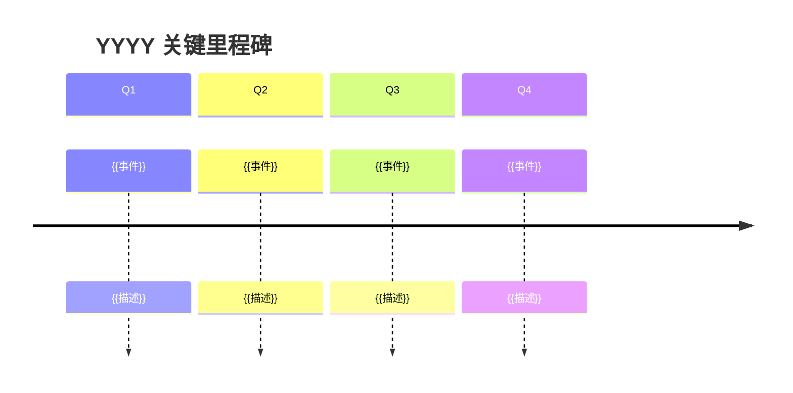
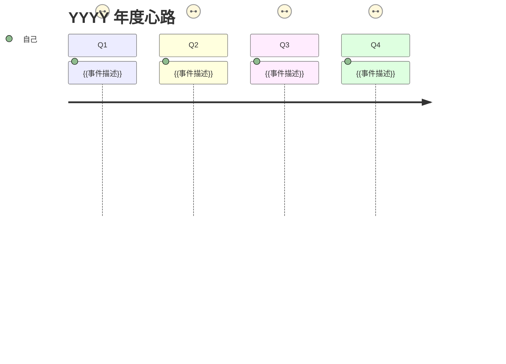

# 本地年报模板（Markdown）

```markdown
---
tags:
aliases:
---

# 年度一句话
> {{用一句话定调全年，让读者 3 秒内抓住这一年的核心主题}}

---

# 年度关键词

**{{关键词1}}** ｜ **{{关键词2}}** ｜ **{{关键词3}}**

---

# 精力全景


```mermaid
gantt
    title YYYY 年度项目时间线
    dateFormat YYYY-MM
    section {{主线A}}
    {{描述}} :{{起始月}}, {{结束月}}
    section {{主线B}}
    {{描述}} :{{起始月}}, {{结束月}}
```

{{1~2 段文字解读精力分配趋势}}

---

# 主线回顾

## {{主线标题：能概括全年变化的短语}}
{{叙事段落：年初什么状态 → 中间经历什么转折 → 年末到了什么阶段。组织方式灵活，不套固定模式。}}

## {{第二主线（按实际增减，2~5 条皆可）}}
{{同上，但叙事方式可以不同}}

---

# 里程碑时间线



{{可选：补充图表中无法展开的细节}}

---

# 年度心路



{{1~3 段叙事：高光和低谷背后的故事，允许感性表达}}

---

# 成长与蜕变

{{从技能/认知/习惯/工具等维度，对比年初和年末的自己。维度按实际选取，不必全覆盖。}}

---

# 年度数据

| 指标 | 数值 |
|------|------|
| 日报总数 | {{existing}}/{{total}} ({{rate}}%) |
| 月报完成 | {{count}}/12 |
| 周报总数 | {{count}} 篇 |
| 日报最密集月 | {{month}} ({{count}} 篇) |
| 日报最稀疏月 | {{month}} ({{count}} 篇) |

{{可选：一句话点评数据趋势}}

---

# 致自己

{{最"人"的部分。感悟、致谢、自我对话。没有固定格式——一段话、几个短句、一封短信皆可。唯一要求：真诚。}}

---

# 新年展望

- [ ] {{方向}} — {{期待/标准}}
- [ ] {{方向}} — {{期待/标准}}
- [ ] {{方向}} — {{期待/标准}}
```

## 使用提醒

- 文件名使用 `YYYY年.md`（如 `2025年.md`），输出到 `05-note/<year>/Yearly/`
- **正文不再重复文件名/笔记标题**，直接从 `# 年度一句话` 开始
- 每个 `#` 章节结束后插入 `---` 分隔线，最后一节不加
- **反公式化**：以上结构仅为骨架。章节可增删、合并、调序。图表在数据不足时可省略。每年的年总结应有不同气质
- **文风**：允许第一人称，鼓励感性表达。像写给年末的自己，不像写给老板的汇报
- **数据源**：主要从月报提炼，不逐读 365 篇日报
- Mermaid 图表共 4 张（pie + gantt + timeline + journey），遵循 mermaid-visualizer 语法规则
- `致自己` 章节没有格式限制，真诚即可
- `新年展望` 不加 P1/P2 优先级标签，年度展望更适合用方向+期待的形式
- 月报覆盖率低于 50% 时，应在文中说明数据基础有限
