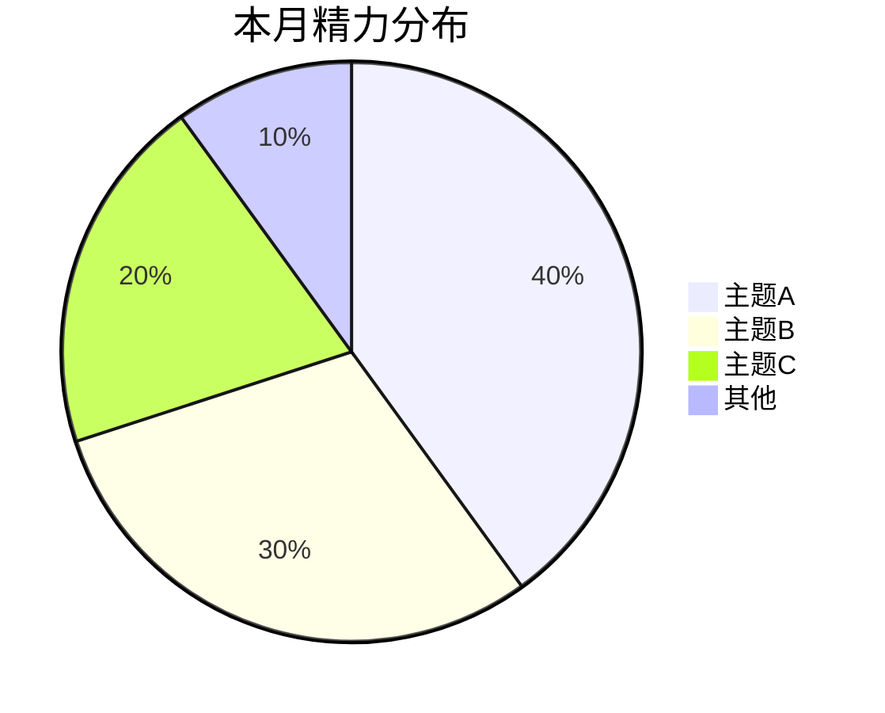

# Monthly Summary

## 适用范围

- 默认假设当前工作区根目录下存在 `05-note/<year>/Daily/*.md`。
- 月报输出目录约定为 `05-note/<year>/Monthly/`；若目录不存在，可在写入时创建。
- 若用户明确给出其他文档库根目录，按用户指定路径执行。
- 若本地不存在 `05-note`，先告知缺少数据入口，再让用户确认正确路径。

## 工作流

1. 解析月区间
- 如果用户明确给出月份，优先接受以下两类格式：
  - ISO 月份格式：`2026-01`
  - 旧标题格式：`1月-26`
- 如果用户说"本月/这个月"，使用当前自然月。
- 如果用户说"上月/上个月"，使用上一自然月。
- 优先使用脚本生成标准月份窗口：

```bash
python3 scripts/month_window.py --which current
python3 scripts/month_window.py --which last
python3 scripts/month_window.py --which explicit --month 2026-01
python3 scripts/month_window.py --which title --title '1月-26'
```

2. 扫描本地日报、周报与月报
- 用 `scripts/collect_local_month_notes.py` 扫描 `05-note`，一次性拿到：
  - 当月日报命中情况
  - 缺失日期
  - 同月周报文件，可作为补充与交叉校验
  - 建议输出的月报路径
  - 最近 2~3 篇历史月报；若本地尚无月报，则回退到历史周报作为文风参考
- 示例：

```bash
python3 scripts/collect_local_month_notes.py --root . --month 2026-01
```

3. 读取并提炼证据
- **周报加速策略**：如果本月已有周报（`supplementary_weekly_files` 非空），优先从周报提炼主线框架和精力分布估算，只回溯日报补充周报未覆盖的细节、验证关键事实。这样可以避免逐篇读 30 篇日报的低效路径。
- 日报始终是主证据来源，周报是中间层加速手段，历史月报只作文风参考。
- **跨月衔接**：如果上月月报存在（`style_reference_files` 中有上月月报），读取其"下月聚焦"章节，在本月"主线与阶段推进"中自然呼应——哪些上月计划完成了、哪些延续了、哪些调整了方向。不需要专设章节，融入叙事即可。
- 提炼时采用**成果导向思维**，不是逐天罗列做了什么，而是回答：
  - 这个月推动了哪几条主线？各主线经历了什么阶段变化？（主线与阶段推进）
  - 精力大致花在哪几个方向？各占多少？（精力分布）
  - 达成了哪些可验证的里程碑？做了哪些关键决策？（关键里程碑与决策）
  - 踩了什么坑？有什么风险？当前处理到什么状态？（踩坑与风险）
  - 下月必须盯住什么？完成标准是什么？（下月聚焦）
- 若个别日期无日报，只记录为缺失，不补写、不猜测。

4. 格式与风格规则
- 默认保持本地月报格式：
  - 文件名使用短日期格式：`M月-YY.md`（如 `3月-26.md`）
  - **正文不再重复文件名/笔记标题**，frontmatter 之后直接从 `# 本月一句话` 开始
  - 保留本地 frontmatter：

```md
---
tags:
aliases:
---
```

- 读取最近 2~3 篇历史月报（或周报），仅借鉴句式和篇幅密度，不继承旧事实。
- 默认文风为任务导向、低主语，不连续使用第一人称"我"。

5. 生成月总结内容
- 以 `references/monthly-summary-template.md` 为结构骨架，不机械套用。
- 严格基于原始日报，不杜撰结论。
- 术语尽量沿用原文，保持项目语境一致。

### 5.1 内容结构（6 个一级章节）

按以下顺序输出。**正文不再重复文件名/笔记标题**，直接从第一个内容章节开始。每个 `#` 章节结束后插入 `---` 分隔线，最后一节不加。

**`# 本月一句话`**
- 用一句话概括本月最核心的推进或转折。
- 用 Markdown 引用语法 `>` 呈现。
- 示例：`> 论文从局部修订推进到终稿交付，知识库与工具链进入自运转阶段`

**`# 精力分布`**
- 根据日报内容估算本月精力在各主题上的粗略百分比分配。
- 使用 `mermaid-visualizer` skill 的语法规则生成 Mermaid 饼图代码块，确保 Obsidian 兼容性。
- 饼图格式：

````md

````

- 主题数量 3~6 个，不需精确到个位数，粗略估算即可。
- 主题命名简洁（2~6 字），如"论文修订""知识库整理""工具链优化""杂务"。

**`# 主线与阶段推进`**
- **月报最核心的章节**，必须体现跨周或跨阶段变化。
- 主线识别必须基于证据抽取，可并行识别多条主线；禁止预设仅有一条主线。
- 每条主线是一个独立的二级标题（`##`），用动词短语命名。
- 每条主线下包含：
  - 1 段概述：全月脉络，体现上中下旬或 W1→W4 的推进差异（叙事，非列表）
  - 一个 `> [!success] 阶段成果` callout：月末达到的状态、具体产出物
- 主线数量按实际内容决定，通常 1~3 条，禁止硬凑。
- 当月主线为论文推进时，论文相关内容合并为一条主线。

**`# 关键里程碑与决策`**
- 合并原"关键里程碑与量化结果"和"关键决策与策略调整"。
- 里程碑用 `> [!success]` callout：优先写可验证成果（版本号、实验批次、提交记录、上线结果、数量指标）。
- 决策用 `> [!note]` callout：必须回答"为什么调整策略"，写清**触发原因**、**调整动作**、**当前效果**。
- 条目数按实际情况增减。

**`# 踩坑与风险`**
- 从日报中提炼问题、风险和正面经验。
- 问题/风险用 `> [!warning]` callout，标题后用 backtick 标注处理状态：`` `已解决` ``、`` `进行中` ``、`` `待决策` ``。
- 收获用 `> [!tip]` callout：做对了什么，为什么值得保留。
- 条目数按实际情况增减，没有就不写此章节。

**`# 下月聚焦`**
- 按优先级列出 3~5 项目标。
- 每项用 checkbox 格式：`- [ ] P1: 目标 ← 完成标准`
- 优先列出有明确阻塞或风险的事项，再列常规计划。

### 5.2 去日期化规则

- **正文中禁止以日期开头叙事**。不得出现 `` `3.09` 完成……``、``第一周做了……`` 这类写法。
- 叙事以成果和主题为锚点，而非时间线。
- 若需要表达时间跨度，用模糊表述："月初""中旬""下旬""持续推进""后半月加速"。
- 唯一例外是"主线与阶段推进"章节，可使用 W1→W4 或上中下旬来体现变化节奏，但仍以成果为主语。
- 若用户明确要求"可追溯明细"，可在末尾追加一个日期映射附录：

```md
# 每日工作映射（可追溯明细）
| 日期 | 主要事项 |
|------|---------|
| 3.01 | …… |
| 3.02 | …… |
```

- 默认不写此附录。

### 5.3 可视化与排版规则

- **每个 `#` 章节结束后插入 `---` 分隔线**，最后一个章节末尾不加。
- 使用 Obsidian callout 语法增强视觉层次：
  - `> [!success]`：里程碑、阶段成果
  - `> [!warning]`：问题、风险
  - `> [!tip]`：正面经验、收获
  - `> [!note]`：关键决策
- Mermaid 饼图仅用于"精力分布"章节，不在其他地方插入图表。
- 下月计划使用 `- [ ]` checkbox + 优先级标签（P1/P2/P3），方便下月复盘勾选。

- 若存在缺失日期，在文末用以下格式说明，不扩展推断：

```md
> 本月日报覆盖率：22/28 (79%)。缺失日期：`2026-02-03`、`2026-02-12`、`2026-02-18` 至 `2026-02-23`。
```

6. 写回本地月报
- 目标路径使用脚本给出的 `monthly_output_path`。
- 若同名文件已存在：
  - 默认先读取旧文件判断是否为已完成月报。
  - 未经用户明确允许，不直接覆盖。
  - 优先改写为 `_v2.md` 或在答复中请用户确认覆盖策略。
- 写入内容前确保父目录存在。

7. 结果回传给用户
- 返回生成的月报路径。
- 列出纳入的日报日期范围与同月周报补充文件。
- 列出缺失日期（若有）。
- 若发生覆盖规避，明确说明最终写入的文件名。

## 执行细节

1. 本地文档定位规则
- 日报路径固定为：`05-note/<year>/Daily/YYYY-MM-DD.md`
- 周报路径固定为：`05-note/<year>/Weekly/M.DD～M.DD-YY.md`
- 月报路径固定为：`05-note/<year>/Monthly/M月-YY.md`（如 `3月-26.md`）

2. 时间规则
- 月总结必须严格限定在单个自然月内。
- 同月周报只作为补充证据，不得引入跨月事实。

3. 兼容旧命名
- 用户若提到 `1月-26` 这类旧月标题，只作为输入解析格式。
- 新生成的本地文件名统一使用短日期格式 `M月-YY.md`，与笔记标题保持一致。

4. 完整性检查
- 交付前必须复核当月日期覆盖率。
- 明确区分主证据（日报）和补充证据（周报/月报）。

## 资源

- `scripts/month_window.py`: 解析月区间，输出标准日期范围、正文标题、文件名。
- `scripts/collect_local_month_notes.py`: 扫描本地 `05-note`，返回日报命中情况、同月周报、建议输出路径、历史风格参考路径。
- `references/monthly-summary-template.md`: 本地月报模板骨架。
- `mermaid-visualizer` skill: 生成 Mermaid 图表时参考其语法规则与兼容性检查清单，防止 Obsidian 渲染异常。
