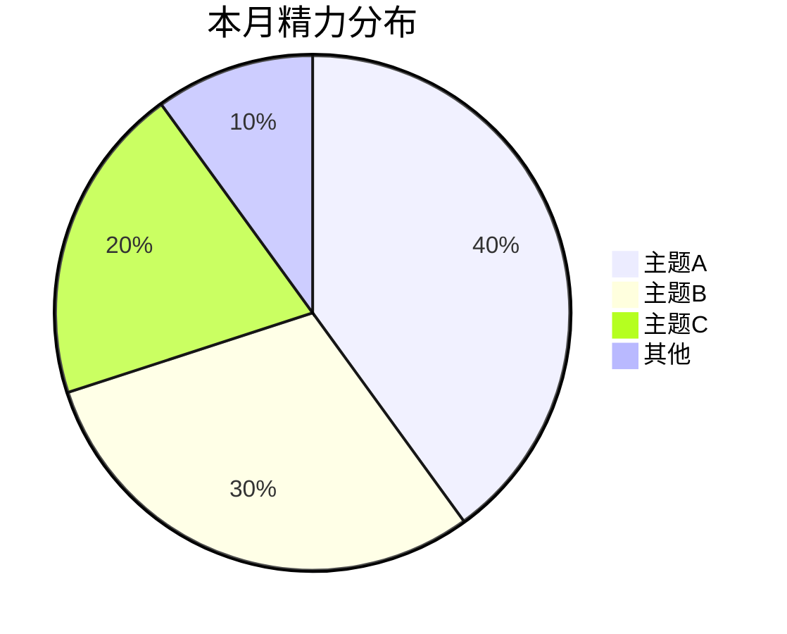

# Monthly Summary

## 适用范围

- 数据源固定为飞书云空间（folder token 配置在 `../summary-shared/lark_folders.json`）。
- 默认结构：根目录下 `daliy/`、`weekly/`、`monthly/` 三个文件夹；每篇日报/周报/月报都是飞书 `docx` 文档（不是本地 Markdown）。
- 文件名约定：日报 `M.D-YY`（如 `5.5-26`）、周报 `M.DD～M.DD-YY`（日两位补零，如 `3.09～3.15-26`）、月报 `M月-YY`（如 `3月-26`）。
- 用户若指定了不同的飞书文件夹结构，先确认 folder token 是否更新到 `lark_folders.json`，再继续执行。

## 工作流

1. 解析月区间
- 如果用户明确给出月份，优先接受以下两类格式：
  - ISO 月份格式：`2026-01`
  - 旧标题格式：`1月-26`
- 如果用户说"本月/这个月"，使用当前自然月。
- 如果用户说"上月/上个月"，使用上一自然月。
- 优先使用脚本生成标准月份窗口：

```bash
python scripts/month_window.py --which current
python scripts/month_window.py --which last
python scripts/month_window.py --which explicit --month 2026-01
python scripts/month_window.py --which title --title '1月-26'
```

2. 扫描飞书 daily/weekly/monthly 文件夹
- 用 `scripts/collect_lark_month_notes.py` 一次性拿到：
  - 当月日报命中情况 `matched_daily_files`（每项含 `name` / `token` / `url`）
  - 缺失日期 `missing_dates`
  - 同月周报 `supplementary_weekly_files`（与月份重叠的 docx）
  - 目标月报文件名 `monthly_output_basename`、是否已存在 `monthly_output_exists`
  - 历史月报 `historical_context_files.monthly_files`（最近 6 篇，按时间倒序）
- 示例：

```bash
python scripts/collect_lark_month_notes.py --month 2026-01
```

- 该脚本读取 `../summary-shared/lark_folders.json` 获取 folder token，禁止把 token 硬编码到任何地方。

3. 读取历史上下文（内观与发现的数据基础）
- 脚本返回的 `historical_context_files.monthly_files` 包含过去 3-6 篇月报。
- **这些文件不是文风参考，而是内容对比素材**——必须读取其实际内容（`lark-cli docs +fetch --doc <url>`），重点关注：
  - 过去月报中「下月聚焦」里的目标项：哪些已完成？哪些一直在拖延？哪些悄悄消失了？
  - 「精力分布」的长期变化趋势：哪个方向在持续扩张或萎缩？
  - 反复出现的踩坑或风险——是否有结构性问题在跨月延续？
  - 「主线与阶段推进」的延续性：哪些主线在本月得到了推进，哪些断裂了？
- 若历史文件较多，优先精读最近 2-3 篇月报，其余扫描关键章节即可。
- **飞书 → markdown 注意事项**：`docs +fetch` 返回值在 `data.markdown`。历史月报里 `精力分布` 章节会显示 `<whiteboard token="..." align="left"/>` 标签——代表那是一张飞书画板，文字内容看不到，但不影响阅读其他章节。

4. 读取并提炼证据
- **周报加速策略**：如果本月已有周报（`supplementary_weekly_files` 非空），优先读周报提炼主线框架和精力分布估算，只回溯日报补充周报未覆盖的细节、验证关键事实。这样可以避免逐篇读 30 篇日报的低效路径。
- 日报始终是主证据来源，周报是中间层加速手段，历史月报只作内容对比与文风参考。
- **跨月衔接**：如果上月月报存在（`historical_context_files.monthly_files[0]`），读取其"下月聚焦"章节，在本月"主线与阶段推进"中自然呼应——哪些上月计划完成了、哪些延续了、哪些调整了方向。不需要专设章节，融入叙事即可。
- 提炼时采用**成果导向思维**，不是逐天罗列做了什么，而是回答：
  - 这个月推动了哪几条主线？各主线经历了什么阶段变化？（主线与阶段推进）
  - 精力大致花在哪几个方向？各占多少？（精力分布）
  - 达成了哪些可验证的里程碑？做了哪些关键决策？（关键里程碑与决策）
  - 踩了什么坑？有什么风险？当前处理到什么状态？（踩坑与风险）
  - 下月必须盯住什么？完成标准是什么？（下月聚焦）
- 若个别日期无日报，只记录为缺失，不补写、不猜测。

5. 格式与风格规则
- 文件名使用 `monthly_output_basename`（如 `3月-26`），不带 `.md` 扩展名（飞书 docx 不需要）。
- **不写 Markdown frontmatter**（飞书 docx 不支持，写了也不会被保留）。
- 正文从 `# 本月一句话` 开始，不重复文件名/标题。
- 读取最近 2~3 篇历史月报（或周报），仅借鉴句式和篇幅密度，不继承旧事实。
- 默认文风为任务导向、低主语，不连续使用第一人称"我"。

6. 生成月总结内容
- 以 `references/monthly-summary-template.md` 为结构骨架，不机械套用。
- 严格基于原始日报，不杜撰结论。
- 术语尽量沿用原文，保持项目语境一致。

**反公式化原则（贯穿全文）：**
- 模板是结构参考，不是填空题。每月的章节内部结构、醒目标记数量、段落长度都应该根据实际内容自然变化。
- **自检**：如果两期月报的结构高度相似（主线数、醒目标记数、下月聚焦条数完全一致），说明过于依赖模板，必须回头根据当月实际情况调整。
- 醒目标记是强调工具，不是装饰。只在有明确产出或决策值得突出时使用，不为凑格式而加。
- 段落的组织方式应跟随内容本身的逻辑：有的主线适合按阶段变化写，有的适合按问题-解决写，有的只需要一段话交代清楚。不要每条主线都套"月初…月中…下旬…"三段论。

### 6.1 内容结构（7 个一级章节）

按以下顺序输出。**正文从第一个 `#` 章节开始**，不写 frontmatter、不重复文件名。每个 `#` 章节结束后插入 `---` 分隔线，最后一节不加。

**`# 本月一句话`**
- 用一句话概括本月最核心的推进或转折。
- 用 Markdown 引用语法 `>` 呈现。
- 示例：`> 论文从局部修订推进到终稿交付，知识库与工具链进入自运转阶段`

**`# 精力分布`**
- 根据日报内容估算本月精力在各主题上的粗略百分比分配。
- **此章节使用飞书画板（whiteboard）呈现**，不要在 markdown 里写 mermaid 代码块。导入主体 markdown 时该章节正文留空，画板由步骤 7 的后处理流程通过 `lark-cli whiteboard +update` 写入（mermaid pie 作为输入格式）。
- 把估算后的内容存为临时 mermaid 文件 `./pie.mmd`，供后续步骤使用：

````md

```mermaid
pie title 本月精力分布
    "主题A" : 40
    "主题B" : 30
    "主题C" : 20
    "其他" : 10
```
````

- 主题数量 3~6 个，不需精确到个位数，粗略估算即可。
- 主题命名简洁（2~6 字），如"论文修订""知识库整理""工具链优化""杂务"。

**`# 主线与阶段推进`**
- **月报最核心的章节**，必须体现跨周或跨阶段变化。
- 主线识别必须基于证据抽取，可并行识别多条主线；禁止预设仅有一条主线。
- 每条主线是一个独立的二级标题（`##`），用动词短语命名。
- 每条主线下至少包含 1 段叙事概述，说清楚这条主线的推进脉络。
  - 叙事组织方式不限：可以按阶段变化（上中下旬）、按问题→解决、按起因→行动→结果，选最自然的方式。不要每条主线都用同一种叙事结构。
  - **✅ 阶段成果**标记是可选的：当主线有明确的、值得突出的可验证产出时使用；如果成果已经在叙事段落中说清楚了，不必再用标记重复。
- 主线数量按实际内容决定，通常 1~4 条，禁止硬凑。有的月份可能只有 1 条强主线，有的月份可能有 4 条并行线。
- 当月主线为论文推进时，论文相关内容合并为一条主线。

**`# 关键里程碑与决策`**
- 里程碑用 **✅**标记：优先写可验证成果（版本号、实验批次、提交记录、上线结果、数量指标）。
- 决策用 **📌**标记：必须回答"为什么调整策略"，写清**触发原因**、**调整动作**、**当前效果**。
- 条目数按实际情况增减。

**`# 踩坑与风险`**
- 从日报中提炼问题、风险和正面经验。
- 问题/风险用 **⚠️**标记，标题后用 backtick 标注处理状态：`` `已解决` ``、`` `进行中` ``、`` `待决策` ``。
- 收获用 **💡**标记：做对了什么，为什么值得保留。
- 条目数按实际情况增减，没有就不写此章节。

**`# 内观与发现`**
- **本章节是整份月报中最"人"的部分。** 月报的视角比周报更宏观，内观也应如此——关注的是月度级别的趋势、长期目标的偏移、生活与工作的节奏变化。
- **文风**：第二人称「你」，直接、走心，像一个了解你很久的朋友在跟你做月度复盘。不需要客气，不需要铺垫，有什么说什么。
- **数据来源**：步骤 3 中读取的历史月报内容，与本月的日报/周报做交叉比对。
- **内容类型**（不固定，按实际情况自由组合，不是每类都要写）：
  - **长期趋势**：跨月的精力分布变化，某条主线的持续推进或逐步放弃
  - **目标追踪**：过去几个月「下月聚焦」里反复出现但未完成的目标，直接质问
  - **节奏观察**：这个月整体的工作密度、情绪状态、产出质量相比前几个月的变化
  - **盲区与矛盾**：声称重要但精力投入极少的方向；实际花了大量时间但从未被列为目标的事
  - **跨领域连接**：不同主线之间的隐含关联——方法论迁移、经验复用、潜在冲突
  - **阶段性肯定**：在更长的时间跨度上，看到某些能力或习惯的积累
  - **方向性建议**：基于多月数据给出的调整建议，不是微观操作，而是方向判断
- **强制反模板规则**：
  - 禁止使用醒目标记（如加粗前缀）——这个章节不是信息卡片，是对话
  - 禁止用列表/bullet 堆砌——必须用段落叙事
  - 每期的长度、角度、语气都应该根据实际发现自然变化；没有深刻发现时宁可短写两段，不要凑字数
  - **自检**：如果连续两期的「内观与发现」在结构和语气上高度相似，说明在套路化，必须调整
- **历史引用**：在提及历史笔记中的具体事项时，直接写出文件名（如 `2月-26`），方便用户回溯上下文。
- **篇幅指引**：月报的内观应比周报更厚实，通常 3-5 段，视发现密度而定。

**`# 下月聚焦`**
- 按优先级列出 3~5 项目标。
- 每项用 checkbox 格式：`- [ ] P1: 目标 ← 完成标准`
- 优先列出有明确阻塞或风险的事项，再列常规计划。

### 6.2 去日期化规则

- **正文中禁止以日期开头叙事**。不得出现 `` `3.09` 完成…… ``、``第一周做了…… `` 这类写法。
- 叙事以成果和主题为锚点，而非时间线。
- 若需要表达时间跨度，用模糊表述："月初""中旬""下旬""持续推进""后半月加速"。
- "主线与阶段推进"章节允许使用时间区段（上中下旬、W1→W4）作为叙事辅助，但不要每条主线都套"月初…月中…下旬…"三段论。时间只是组织手段之一，不是唯一手段。
- 若用户明确要求"可追溯明细"，可在末尾追加日期映射附录：

```md
# 每日工作映射（可追溯明细）
| 日期 | 主要事项 |
|------|---------|
| 3.01 | …… |
| 3.02 | …… |
```

- 默认不写此附录。

### 6.3 可视化与排版规则

- **每个 `#` 章节结束后插入 `---` 分隔线**，最后一个章节末尾不加。
- 使用加粗前缀标记增强视觉层次：
  - `**✅**`：里程碑、阶段成果
  - `**⚠️**`：问题、风险
  - `**💡**`：正面经验、收获
  - `**📌**`：关键决策
- `精力分布` 章节用飞书画板渲染（步骤 7 后处理），markdown 里不写 mermaid 代码块。
- 下月计划使用 `- [ ]` checkbox + 优先级标签（P1/P2/P3）。
- 若存在缺失日期，在文末用以下格式说明，不扩展推断：

```md
> 本月日报覆盖率：22/28 (79%)。缺失日期：`2026-02-03`、`2026-02-12`、`2026-02-18` 至 `2026-02-23`。
```

7. 写回飞书月报
- 输出步骤：
  1. 在临时目录生成 markdown 文件，文件名为 `<monthly_output_basename>.md`（如 `4月-26.md`）。**markdown 中不要写 mermaid 代码块**——`# 精力分布` 章节正文留空（标题下直接接 `---` 分隔线），画板会在 import 后通过后处理写入。
  2. 检查 `monthly_output_exists`：
     - 若为 false，直接执行步骤 3。
     - 若为 true，**未经用户明确允许，不要覆盖**。改用 `monthly_output_basename_v2`（即 `<basename>_v2`）作为目标文件名，并在最终回复里告知用户。
  3. 上传成 docx：

```bash
lark-cli drive +import --type docx \
  --file ./<basename>.md \
  --folder-token <monthly_folder_token> \
  --name <output_basename>
# 记下返回的 data.url 作为 DOC_URL
```

  4. 在 `# 精力分布` 章节后插入空白画板，拿到 board_token：

```bash
lark-cli docs +update \
  --doc <DOC_URL> \
  --mode insert_after \
  --selection-by-title "# 精力分布" \
  --markdown '<whiteboard type="blank"></whiteboard>'
# 记下返回的 data.board_tokens[0] 作为 WB_PIE_TOKEN
```

  5. 把第 6.1 节准备好的 `./pie.mmd` 写入画板：

```bash
lark-cli whiteboard +update \
  --whiteboard-token <WB_PIE_TOKEN> \
  --input_format mermaid \
  --source @./pie.mmd \
  --idempotent-token "wb-pie-$(date +%s)" \
  --overwrite --yes --as user
```

  6. 验证最终 doc URL，写入临时记录中。

- 整套流程把"主体内容"和"画板内容"解耦：主体走 `drive +import`，图表走 `lark-whiteboard` skill 的官方路径，避免 mermaid 自动转换的风格不一致。

8. 结果回传给用户
- 返回新生成的飞书月报 URL。
- 列出纳入的日报日期范围与同月周报补充文件名。
- 列出缺失日期（若有）。
- 列出写入的画板 token（方便用户后续编辑/查看）。
- 若发生覆盖规避，明确说明最终写入的文件名。

## 执行细节

1. 飞书文件命名规则
- 日报：`M.D-YY`（不补零，如 `5.5-26`、`4.30-26`）。
- 周报：`M.DD～M.DD-YY`（日补零，如 `3.09～3.15-26`、`4.20～4.26-26`）。
- 月报：`M月-YY`（如 `3月-26`）。
- 这些规则已编码在 `collect_lark_month_notes.py` 与 `month_window.py` 中，不要在 SKILL.md 之外手动拼接。

2. 时间规则
- 月总结必须严格限定在单个自然月内。
- 同月周报只作为补充证据，不得引入跨月事实。

3. 跨年场景
- 当月份为 1 月时，`historical_context_files` 会自然包含上一年 12 月的月报；不需要特殊处理。

4. 完整性检查
- 交付前必须复核当月日期覆盖率。
- 明确区分主证据（日报）和补充证据（周报/历史月报）。

5. 配置与权限
- folder token 集中放在 `../summary-shared/lark_folders.json`，三个 summary skill 共用。
- 修改飞书数据源（如换文件夹）时，只需修改这一个文件。
- 调用 `lark-cli` 前确保已登录（`lark-cli auth login`）；若返回 `permission denied`，提示用户检查身份。

## 资源

- `scripts/month_window.py`: 解析月区间，输出标准日期范围、正文标题、文件名候选。
- `scripts/collect_lark_month_notes.py`: 通过 `lark-cli` 扫描飞书 daily/weekly/monthly 文件夹，返回日报命中、同月周报、目标月报文件名、历史月报。
- `references/monthly-summary-template.md`: 月报模板骨架（无 frontmatter，无 mermaid 代码块）。
- `lark-whiteboard` skill: 画板写入的官方路径，本 skill 第 7 步直接复用其 `whiteboard +update` 流程。
- `../summary-shared/lark_folders.json`: 共享 folder token 配置。
