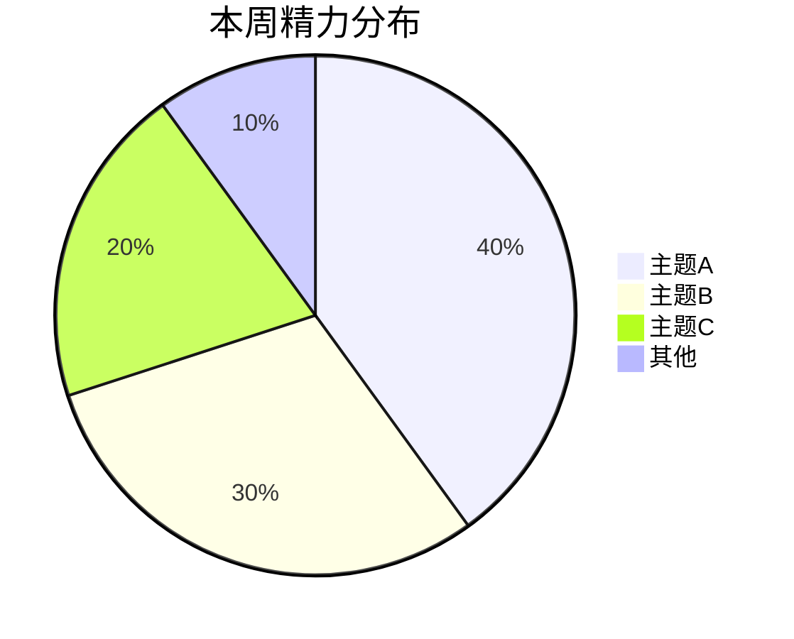

# Weekly Summary

## 适用范围

- 数据源固定为飞书云空间（folder token 配置在 `../summary-shared/lark_folders.json`）。
- 默认结构：根目录下 `daliy/`、`weekly/`、`monthly/` 三个文件夹；每篇日报/周报/月报都是飞书 `docx` 文档（不是本地 Markdown）。
- 文件名约定：日报 `M.D-YY`（如 `5.5-26`）、周报 `M.DD～M.DD-YY`（日两位补零，如 `3.09～3.15-26`）、月报 `M月-YY`（如 `3月-26`）。年份靠 `-YY` 后缀区分，文件夹本身扁平。
- 用户若指定了不同的飞书文件夹结构，先确认 folder token 是否更新到 `lark_folders.json`，再继续执行。

## 工作流

1. 解析周区间
- 如果用户明确给出区间，优先接受以下两类格式：
  - 旧标题格式：`1.19～1.25-26`
  - ISO 文件名格式：`2026-01-19～2026-01-25`
- 如果用户说"本周/这周"，按周一到周日计算。
- 如果用户说"上周"，使用上一周周一到周日。
- 优先使用脚本生成标准周窗口：

```bash
python scripts/week_window.py --which current
python scripts/week_window.py --which last
python scripts/week_window.py --which explicit --start 2026-01-19 --end 2026-01-25
python scripts/week_window.py --which title --title '1.19～1.25-26'
```

2. 扫描飞书 daily/weekly/monthly 文件夹
- 用 `scripts/collect_lark_notes.py` 一次性拿到：
  - 本周应纳入的日报 docx 列表（`matched_daily_files`：包含 `name` / `token` / `url`）
  - 缺失日期 `missing_dates`
  - 目标周报文件名 `weekly_output_basename`、是否已存在 `weekly_output_exists`
  - 跨周/跨月历史上下文 `historical_context_files`（最近 8 篇周报 + 最近 2 篇月报）
- 示例：

```bash
python scripts/collect_lark_notes.py --start 2026-01-19 --end 2026-01-25
```

- 该脚本读取 `../summary-shared/lark_folders.json` 获取 folder token，禁止把 token 硬编码到任何地方。

3. 读取历史上下文（内观与发现的数据基础）
- 脚本返回的 `historical_context_files` 包含过去 6-8 篇周报和最近 1-2 篇月报。
- **这些文件不是文风参考，而是内容对比素材**——必须读取其实际内容（用 `lark-cli docs +fetch --doc <url>`），重点关注：
  - 过去周报中「未闭合 & 下周聚焦」里的 checkbox 项：哪些一直在拖？哪些消失了？
  - 「精力分布」的变化趋势：哪个方向在持续扩张或萎缩？
  - 反复出现的踩坑或收获——是否有结构性问题未被解决？
  - 过去月报中的「下月聚焦」——用户设定的中期目标是否在本周有所推进？
- 若历史文件较多，优先精读最近 3-4 篇周报和 1 篇月报，其余扫描关键章节即可。
- **飞书 → markdown 的注意事项**：`docs +fetch` 默认走 v1 API（已弃用警告可忽略，不要主动加 `--api-version v2` 除非 lark-doc skill 明确要求）。返回值在 `data.markdown` 字段里。历史周报里 `精力分布` 章节会显示 `<whiteboard token="..." align="left"/>` 标签——代表那是一张飞书画板，文字内容看不到，但不影响阅读其他章节。

4. 读取并提炼日报
- 对 `matched_daily_files` 中每一篇，用 `lark-cli docs +fetch --doc <url>` 拉取 markdown 正文。
- 提炼时采用**成果导向思维**，不是逐天罗列做了什么，而是回答：
  - 这周推到了哪几个"终点"或"里程碑"？（关键进展）
  - 精力大致花在哪几个方向？各占多少？（精力分布）
  - 踩了什么坑？做对了什么？有什么值得下次复用的经验？（踩坑与收获）
  - 哪些事情没闭合，下周必须盯住？（未闭合 & 下周聚焦）
- 若个别日期无日报，只记录为缺失，不补写、不猜测。

5. 格式与风格规则
- 文件名使用 `weekly_output_basename`（不带 `.md` 后缀，飞书 docx 不需要扩展名），如 `3.09～3.15-26`。
- **不写 Markdown frontmatter**（飞书 docx 不支持 `---\ntags:\naliases:\n---`，写了也不会被保留）。
- 正文从 `# 本周一句话` 开始，不重复文件名/标题。
- 读取 `historical_context_files.weekly_files` 中最近 2~3 篇做文风参考，**只借鉴句式和篇幅密度，不继承旧事实**。
- 默认文风为任务导向、低主语，不连续使用第一人称"我"。

6. 生成周总结内容
- 以 `references/weekly-summary-template.md` 为结构骨架，不机械套用。
- 严格基于原始日报，不杜撰结论。
- 术语尽量沿用原文，保持项目/论文语境一致。

**反公式化原则（贯穿全文）：**
- 模板是结构参考，不是填空题。每周的章节内部结构、醒目标记数量、段落长度都应该根据实际内容自然变化。
- **自检**：如果两期周报的结构高度相似（成果数、醒目标记数、下周条数完全一致），说明过于依赖模板，必须回头根据当周实际情况调整。
- 醒目标记是强调工具，不是装饰。只在有明确产出或教训值得突出时使用，不为凑格式而加。

### 6.1 内容结构（6 个一级章节）

按以下顺序输出。**正文从第一个 `#` 章节开始**，不写 frontmatter、不重复文件名。每个 `#` 章节结束后插入 `---` 分隔线，增强视觉层次。

**`# 本周一句话`**
- 用一句话概括本周最核心的推进或转折。
- 用 Markdown 引用语法 `>` 呈现。
- 示例：`> 论文V8完成收口提交，知识库体系开始自运转`

**`# 精力分布`**
- 根据日报内容估算本周精力在各主题上的粗略百分比分配。
- **此章节使用飞书画板（whiteboard）呈现**，不要在 markdown 里写 mermaid 代码块。导入主体 markdown 时该章节正文留空，画板由步骤 7 的后处理流程通过 `lark-cli whiteboard +update` 写入（mermaid pie 作为输入格式）。
- 把估算后的内容存为临时 mermaid 文件 `./pie.mmd`，供后续步骤使用：

````md

````

- 主题数量 3~5 个，不需精确到个位数，粗略估算即可。
- 主题命名简洁（2~6 字），如"论文修订""知识库整理""工具链优化""杂务"。

**`# 关键进展`**
- **按成果组织，不按天排列**。每个成果是一个独立的二级标题（`##`）。
- 二级标题用动词短语命名，如"完成论文V8收口""知识库本地化闭环"。
- 每个成果下至少包含 1 段叙事概述，说清楚从什么状态推进到什么状态。
  - **✅ 产出**标记是可选的：当有明确的可验证交付物时使用；如果成果已经在段落中说清楚了，不必再加标记。
  - `**意义**` 行是可选的：当成果的意义不言自明时可以省略，不要为了格式而写一句废话。
- 成果数量按实际内容决定，通常 1~4 个，禁止硬凑。有的周可能只有 1 件大事，有的周可能有 4 件并行推进。
- 当周主线为论文推进时，论文相关内容合并为一个成果。

**`# 踩坑与收获`**
- 从日报中提炼教训和正面经验，不是简单罗列"存在问题"。
- 教训用 **⚠️ 警告**标记：发生了什么 → 根因 → 下次怎么做。
- 收获用 **💡 提示**标记：做对了什么，为什么值得保留。
- 条目数按实际情况增减，没有就不写此章节。

**`# 内观与发现`**
- **本章节是整份周报中最"人"的部分。** 它不是事实总结，而是基于历史上下文的洞察、提醒和对话。
- **文风**：第二人称「你」，直接、走心，像一个了解你很久的朋友在跟你说话。不需要客气，不需要铺垫，有什么说什么。
- **数据来源**：步骤 3 中读取的历史周报和月报内容，与本周日报做交叉比对。
- **内容类型**（不固定，按实际情况自由组合，不是每类都要写）：
  - **趋势洞察**：精力分布在过去几周的变化方向，某个主题的扩张或消失
  - **盲区提醒**：过去周报/月报里说要做但本周完全没有动作的事项，直接点出来
  - **矛盾发现**：精力实际分布与自己设定的优先级之间的偏差
  - **状态观察**：从日报密度、内容深浅、情绪词汇推断出的状态变化
  - **跨主题连接**：不同项目/领域之间的隐含关联——踩的坑、用的方法、学到的东西
  - **正向肯定**：某件长期铺垫的事闭合了，或某个新习惯在建立，值得被看见
  - **直接建议**：基于以上发现给出的具体行动建议，不是泛泛而谈
- **强制反模板规则**：
  - 禁止使用醒目标记（如加粗前缀）——这个章节不是信息卡片，是对话
  - 禁止用列表/bullet 堆砌——必须用段落叙事
  - 每期的长度、角度、语气都应该根据实际发现自然变化；没有深刻发现时宁可短写两段，不要凑字数
  - **自检**：如果连续两期的「内观与发现」在结构和语气上高度相似，说明在套路化，必须调整
- **历史引用**：在提及历史笔记中的具体事项时，直接写出文件名（如 `3.02～3.08-26`），方便用户回溯上下文。
- **篇幅指引**：这个章节应该是有实质内容的，不要一两句话敷衍。通常 2-4 段，视发现密度而定。

**`# 未闭合 & 下周聚焦`**
- 合并"存在问题"和"下周计划"，形成有因果链的行动项。
- 每项用 checkbox 格式：`- [ ] 行动项 ← 原因/背景`
- 优先列出有明确阻塞或风险的事项，再列常规计划。
- 通常 3~6 项。

### 6.2 去日期化规则

- **正文中禁止以日期开头叙事**。不得出现 `` `3.09` 完成…… ``、``周一做了…… `` 这类写法。
- 叙事以成果和主题为锚点，而非时间线。
- 若需要表达时间跨度，用模糊表述："本周前半段""中段""后期""持续推进"。
- 若用户明确要求"可追溯明细"，可在末尾追加日期映射附录：

```md
# 每日工作映射（可追溯明细）
| 日期 | 主要事项 |
|------|---------|
| 3.09 | …… |
| 3.10 | …… |
```

- 默认不写此附录。

### 6.3 可视化与排版规则

- **每个 `#` 章节结束后插入 `---` 分隔线**，最后一个章节末尾不加。
- 使用加粗前缀标记增强视觉层次：
  - `**✅**`：产出、里程碑
  - `**⚠️**`：教训、风险
  - `**💡**`：正面经验、收获
- `精力分布` 章节用飞书画板渲染（步骤 7 后处理），markdown 里不写 mermaid 代码块。
- 下周计划使用 `- [ ]` checkbox。
- 若存在缺失日期，在文末用一句话简短说明"某些日期无日报，未纳入总结"，不扩展推断。

7. 写回飞书周报
- 输出步骤：
  1. 在临时目录生成 markdown 文件，文件名为 `<weekly_output_basename>.md`（如 `3.09～3.15-26.md`）。**markdown 中不要写 mermaid 代码块**——`# 精力分布` 章节正文留空（标题下直接接 `---` 分隔线），画板会在 import 后通过后处理写入。
  2. 检查 `weekly_output_exists`：
     - 若为 false，直接执行步骤 3。
     - 若为 true，**未经用户明确允许，不要覆盖**。改用 `weekly_output_basename_v2`（即 `<basename>_v2`）作为目标文件名，并在最终回复里告知用户。
  3. 上传成 docx：

```bash
lark-cli drive +import --type docx \
  --file ./<basename>.md \
  --folder-token <weekly_folder_token> \
  --name <output_basename>
# 记下返回的 data.url 作为 DOC_URL
```

  4. 在 `# 精力分布` 章节后插入空白画板，拿到 board_token：

```bash
lark-cli docs +update \
  --doc <DOC_URL> \
  --mode insert_after \
  --selection-by-title "# 精力分布" \
  --markdown '<whiteboard type="blank"></whiteboard>'
# 记下返回的 data.board_tokens[0] 作为 WB_PIE_TOKEN
```

  5. 把第 5.1 节准备好的 `./pie.mmd` 写入画板：

```bash
lark-cli whiteboard +update \
  --whiteboard-token <WB_PIE_TOKEN> \
  --input_format mermaid \
  --source @./pie.mmd \
  --idempotent-token "wb-pie-$(date +%s)" \
  --overwrite --yes --as user
```

  6. 验证最终 doc URL，写入临时记录中。

- 整套流程把"主体内容"和"画板内容"解耦：主体走 `drive +import`，图表走 `lark-whiteboard` skill 的官方路径，避免 mermaid 自动转换的风格不一致。

8. 结果回传给用户
- 返回新生成的飞书周报 URL。
- 列出纳入的日报日期（如 `4.27 → 5.3`）。
- 列出缺失日期（若有）。
- 列出写入的画板 token（方便用户后续编辑/查看）。
- 若发生覆盖规避，明确说明最终写入的文件名。

## 执行细节

1. 飞书文件命名规则
- 日报：`M.D-YY`（不补零，如 `5.5-26`、`4.30-26`）。
- 周报：`M.DD～M.DD-YY`（日补零，如 `3.09～3.15-26`、`4.20～4.26-26`）。
- 月报：`M月-YY`（如 `3月-26`）。
- 这些规则已编码在 `collect_lark_notes.py` 与 `week_window.py` 中，不要在 SKILL.md 之外手动拼接。

2. 时间规则
- 默认周一为起始日，周日为结束日。
- 检索与写入必须保持在同一自然周内，避免跨周混入。

3. 跨年周
- 若窗口跨 2025/2026，`collect_lark_notes.py` 会自动匹配 `-25` 和 `-26` 后缀的日报，无需特殊处理。

4. 缺失数据处理
- 缺日报时仅标记缺失，不从其他来源补齐。
- 不得根据相邻日期内容推断缺失日发生的事项。

5. 配置与权限
- folder token 集中放在 `../summary-shared/lark_folders.json`，三个 summary skill 共用。
- 修改飞书数据源（如换文件夹）时，只需修改这一个文件。
- 调用 `lark-cli` 前确保已登录（`lark-cli auth login`）；若返回 `permission denied`，提示用户检查身份。

## 资源

- `scripts/week_window.py`: 解析周区间，输出标准日期范围、正文标题、文件名候选。
- `scripts/collect_lark_notes.py`: 通过 `lark-cli` 扫描飞书 daily/weekly/monthly 文件夹，返回日报命中、目标周报文件名、历史上下文。
- `references/weekly-summary-template.md`: 周报模板骨架（无 frontmatter，无 mermaid 代码块）。
- `lark-whiteboard` skill: 画板写入的官方路径，本 skill 第 7 步直接复用其 `whiteboard +update` 流程。
- `../summary-shared/lark_folders.json`: 共享 folder token 配置。
