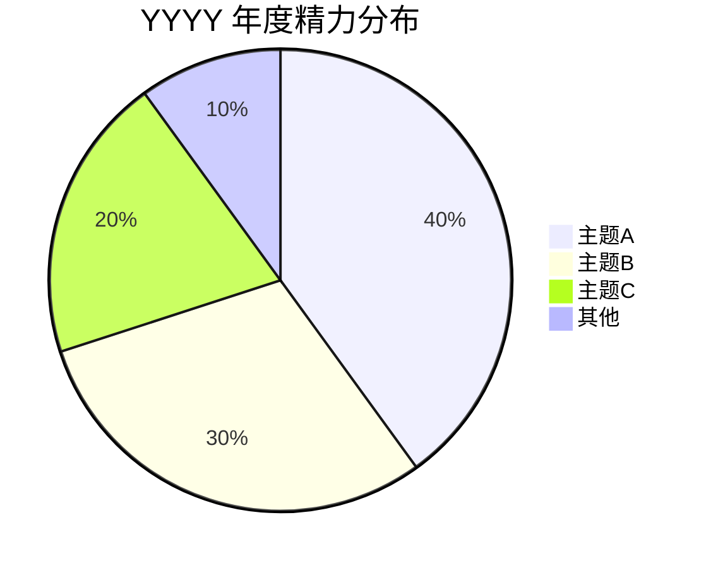
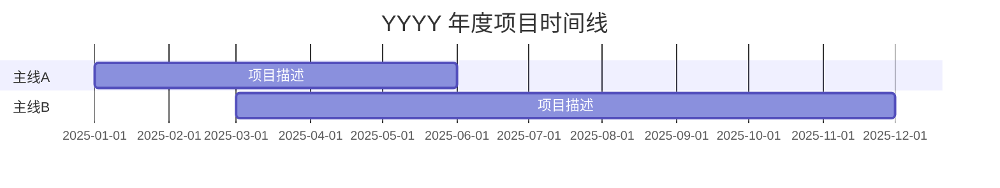
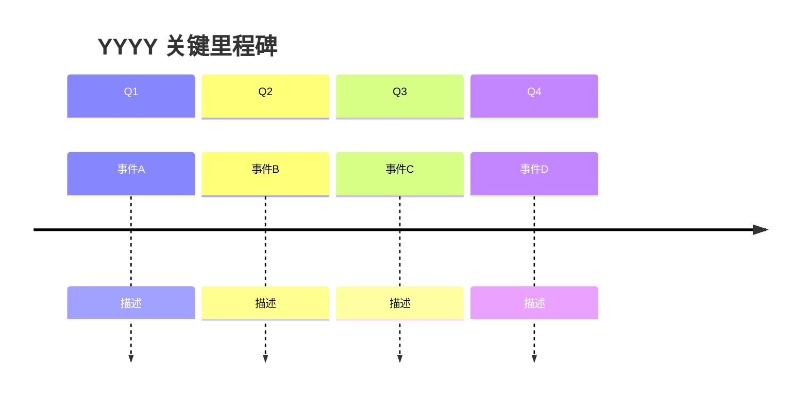
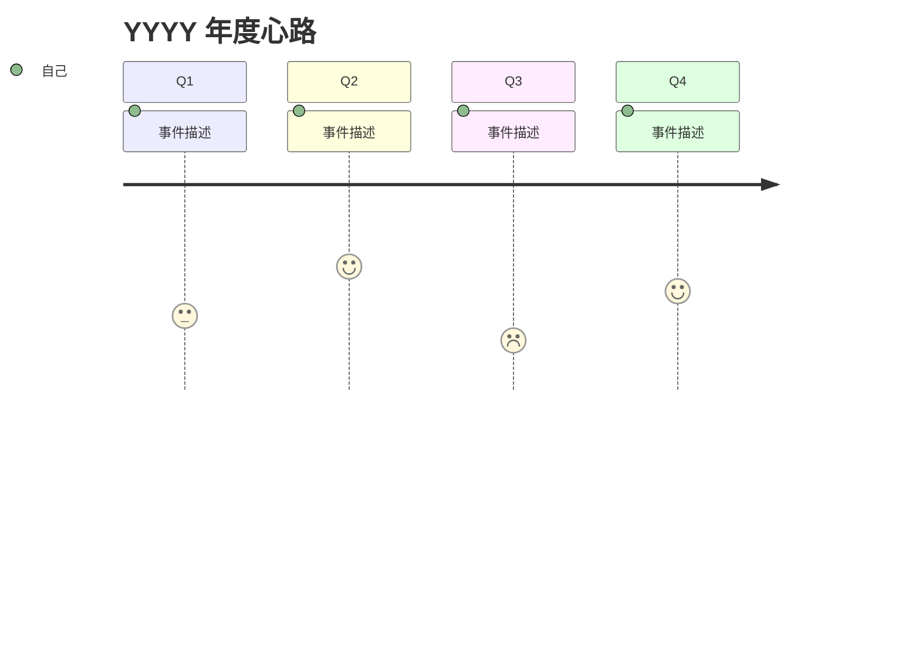

# Yearly Summary

## 适用范围

- 默认假设当前工作区根目录下存在 `05-note/<year>/Monthly/*.md`。
- 年报输出目录约定为 `05-note/<year>/Yearly/`；若目录不存在，可在写入时创建。
- 若用户明确给出其他文档库根目录，按用户指定路径执行。
- 若本地不存在 `05-note`，先告知缺少数据入口，再让用户确认正确路径。

## 工作流

1. 解析年份
- 如果用户明确给出年份，直接使用。
- 如果用户说"今年"，使用当前年份。
- 如果用户说"去年"，使用上一年份。
- 优先使用脚本生成标准年份窗口：

```bash
python3 scripts/year_window.py --which current
python3 scripts/year_window.py --which last
python3 scripts/year_window.py --which explicit --year 2025
```

2. 扫描本地月报、周报与日报
- 用 `scripts/collect_local_year_notes.py` 扫描 `05-note`，一次性拿到：
  - 当年已有的月报路径列表及缺失月份
  - 当年全部周报路径
  - 每月日报覆盖率统计
  - 建议输出的年报路径
  - 上一年年报（如有），作为风格参考
- 示例：

```bash
python3 scripts/collect_local_year_notes.py --root . --year 2025
```

3. 读取并提炼证据
- **月报优先策略**：年报的主要数据源是 12 篇月报（或已有的部分），不逐篇读 365 篇日报。
  - 先读所有已有月报，从中提炼全年主线、精力分布、里程碑和心路历程。
  - 月报缺失的月份，回退到该月周报补充；周报也缺失才读日报。
- **跨年衔接**：如果上年年报存在（`style_reference_files`），读取其"新年展望"章节，在本年"主线回顾"中自然呼应——哪些去年的愿景实现了、哪些调整了、哪些放弃了。
- 提炼时采用**回顾性叙事思维**，回答以下问题：
  - 这一年推动了哪几条主线？各主线跨越了哪些月份？经历了什么转折？（主线回顾）
  - 精力整体花在哪几个方向？哪些项目时间跨度最长？（精力全景）
  - 全年最关键的里程碑和转折点是什么？（里程碑时间线）
  - 全年的情绪起伏、高光与低谷分别在什么时候？因为什么？（年度心路）
  - 年初的自己和年末的自己，在技能、认知、习惯上有什么变化？（成长与蜕变）
  - 全年的数据画像是什么样的？（年度数据）
  - 想对自己说什么？（致自己）
  - 明年想做什么？（新年展望）
- 若个别月份无月报也无周报，只标记为缺失，不补写、不猜测。

4. 格式与风格规则
- 文件名使用 `YYYY年.md`（如 `2025年.md`）
- 输出路径：`05-note/<year>/Yearly/`
- **正文不再重复文件名/笔记标题**，frontmatter 之后直接从 `# 年度一句话` 开始
- 保留本地 frontmatter：

```md
---
tags:
aliases:
---
```

- 读取上一年年报（如有），仅借鉴句式和篇幅密度，不继承旧事实。
- **文风特殊规则**：年总结不同于周/月报的任务导向文风。
  - **允许并鼓励第一人称**：可以用"我"，可以写感受、感悟、自我对话。
  - **允许感性表达**：可以幽默、可以抒情、可以坦诚地写困惑和迷茫。
  - **像写给年末的自己的一封信**，不像写给老板的汇报。
  - 但仍需基于日报/月报证据，不杜撰事实。

5. 生成年总结内容
- 以 `references/yearly-summary-template.md` 为结构骨架，不机械套用。
- 严格基于原始月报/周报/日报，不杜撰结论。
- 术语尽量沿用原文，保持项目语境一致。

**反公式化原则（贯穿全文）：**
- 年总结是全年中最个性化的一篇文档。模板是骨架，不是填空题。
- 章节可以根据实际内容增减、合并、调整顺序。如果某个章节当年没有内容支撑，可以跳过。
- 图表是增强理解的工具，不是装饰。如果某张图表在当年数据下没有意义（如只有 3 个月的月报），可以省略。
- 每年的年总结应该有不同的气质，反映当年的真实面貌。

### 5.1 内容结构（10 个一级章节）

按以下顺序输出。每个 `#` 章节结束后插入 `---` 分隔线，最后一节不加。

**`# 年度一句话`**
- 用一句话定调全年。
- 用 Markdown 引用语法 `>` 呈现。
- 示例：`> 从"边学边做"到"有体系地推进"，这一年的关键词是收敛。`

**`# 年度关键词`**
- 提炼 3~5 个最能代表这一年的词或短语。
- 用 `**粗体**` 呈现，一行排列，用 `｜` 分隔。
- 示例：`**收敛** ｜ **代码重构** ｜ **论文交付** ｜ **工具链觉醒**`

**`# 精力全景`**
- 包含两张 Mermaid 图表：
  1. **饼图**：全年精力在各大方向上的粗略百分比。主题 3~6 个。
  2. **甘特图**：主要项目/主线的时间跨度，按月显示哪些事在什么时段推进。
- 图表后可加 1~2 段文字简要解读趋势。
- 使用 `mermaid-visualizer` skill 的语法规则确保 Obsidian 兼容性。

饼图格式：
````md

````

甘特图格式：
````md

````

**`# 主线回顾`**
- **年报最核心的章节**，必须体现跨月或跨季度的变化弧线。
- 每条主线是一个独立的二级标题（`##`），用能概括全年变化的短语命名。
- 每条主线下用叙事段落讲清楚：年初是什么状态 → 中间经历了什么转折 → 年末到了什么阶段。
- 叙事方式灵活：可以按时间线、按问题→解决、按阶段跃迁。不要每条主线都用同一种写法。
- `[!success]` callout 可选：当主线有明确的年度性成果时使用。
- 主线数量按实际内容决定，通常 2~5 条。

**`# 里程碑时间线`**
- 用 Mermaid `timeline` 图表按季度排列全年关键节点。
- 图表后可用简短文字补充图表中无法展开的细节。

````md

````

**`# 年度心路`**
- 用 Mermaid `journey` 旅程图可视化全年情绪/状态起伏（1~5 分）。
- 图表后用 1~3 段叙事讲述高光和低谷背后的故事。
- 这个章节允许最多的感性表达：困惑、焦虑、成就感、释然都可以写。

````md

````

**`# 成长与蜕变`**
- 对比年初和年末的自己，从以下维度展开（按实际情况选取，不必全覆盖）：
  - 技能：新学会了什么？哪些技能从生疏到熟练？
  - 认知：对研究/工作/生活的理解有什么变化？
  - 习惯：建立了什么新习惯？改掉了什么旧习惯？
  - 工具：工作流/工具链有什么升级？
- 可以用对比式写法，也可以用叙事式。

**`# 年度数据`**
- 用 Markdown 表格呈现全年数据画像：

```md
| 指标 | 数值 |
|------|------|
| 日报总数 | {{existing}}/{{total}} ({{rate}}%) |
| 月报完成 | {{count}}/12 |
| 周报总数 | {{count}} 篇 |
| 日报最密集月 | {{month}} ({{count}} 篇) |
| 日报最稀疏月 | {{month}} ({{count}} 篇) |
```

- 数据来自 `collect_local_year_notes.py` 的输出，不需要猜测。
- 可以在表格后加一句话点评数据趋势。

**`# 致自己`**
- 这是年总结中最"人"的部分。
- 可以写：感悟、致谢（导师、同学、工具、自己）、自我对话、未说出口的话。
- 没有固定格式：可以是一段话、几个短句、一封短信、甚至一首打油诗。
- 唯一要求：真诚。

**`# 新年展望`**
- 面向下一年的方向和期待。
- 用 checkbox 格式，不加优先级标签（年度展望不需要 P1/P2 的精确排序）。
- 每项可附带简短的期待或完成标准。
- 通常 3~6 项。

```md
- [ ] {{方向}} — {{期待/标准}}
```

### 5.2 去日期化规则

- 正文中禁止以精确日期开头叙事。不得出现 `` `2025-07-15` 完成了…… `` 这类写法。
- 叙事以主线、事件和转折为锚点，使用模糊时间表述："年初""春天""年中""下半年""入秋后""年末"。
- 唯一例外：里程碑时间线图表中可使用季度标记（Q1/Q2/Q3/Q4）。

### 5.3 可视化与排版规则

- **每个 `#` 章节结束后插入 `---` 分隔线**，最后一个章节末尾不加。
- 使用 Obsidian callout 语法增强视觉层次（可选，按需使用）：
  - `> [!success]`：年度性成果、重大里程碑
  - `> [!warning]`：踩坑、风险回顾
  - `> [!tip]`：正面经验、顿悟时刻
  - `> [!quote]`：致自己章节中的引用或感悟
- Mermaid 图表分布在以下章节：
  - 精力全景：pie + gantt（2 张）
  - 里程碑时间线：timeline（1 张）
  - 年度心路：journey（1 张）
- 所有 Mermaid 图表遵循 `mermaid-visualizer` skill 的语法规则。
- 新年展望使用 `- [ ]` checkbox。

6. 写回本地年报
- 目标路径使用脚本给出的 `yearly_output_path`。
- 若 `Yearly` 目录不存在，创建之。
- 若同名文件已存在：
  - 默认先读取旧文件判断是否为已完成年报。
  - 未经用户明确允许，不直接覆盖。
  - 优先改写为 `_v2.md` 或在答复中请用户确认覆盖策略。
- 写入内容前确保父目录存在。

7. 结果回传给用户
- 返回生成的年报路径。
- 列出纳入的月报数量和缺失月份。
- 列出全年日报覆盖率。
- 若发生覆盖规避，明确说明最终写入的文件名。

## 执行细节

1. 本地文档定位规则
- 日报路径：`05-note/<year>/Daily/YYYY-MM-DD.md`
- 周报路径：`05-note/<year>/Weekly/M.DD～M.DD-YY.md`
- 月报路径：`05-note/<year>/Monthly/M月-YY.md`
- 年报路径：`05-note/<year>/Yearly/YYYY年.md`

2. 数据层级
- 月报是年报的主证据来源（已经过一次提炼）。
- 周报是月报缺失时的回退来源。
- 日报是周报也缺失时的最终回退来源。
- 绝大多数情况下不需要读日报原文。

3. 完整性检查
- 交付前必须报告月报覆盖率（如 `6/12`）和日报覆盖率。
- 如果月报覆盖率低于 50%，应在年报中明确说明数据基础有限，结论仅供参考。

## 资源

- `scripts/year_window.py`: 解析年份，输出标准日期范围、年报标题、文件名。
- `scripts/collect_local_year_notes.py`: 扫描本地 `05-note`，返回月报/周报/日报覆盖情况、建议输出路径、上年年报参考。
- `references/yearly-summary-template.md`: 本地年报模板骨架。
- `mermaid-visualizer` skill: 生成 Mermaid 图表时参考其语法规则与兼容性检查清单，防止 Obsidian 渲染异常。
