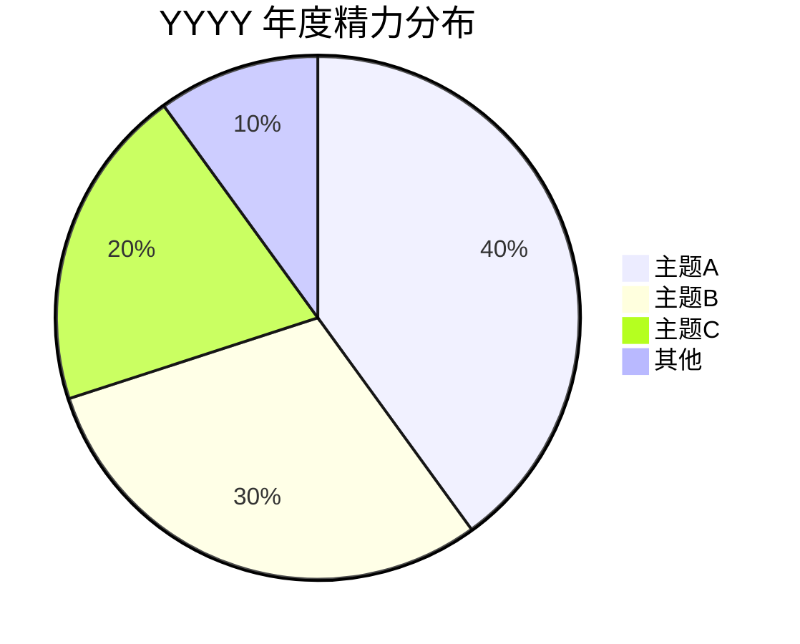
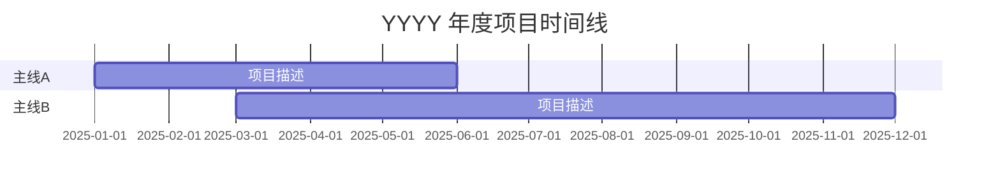
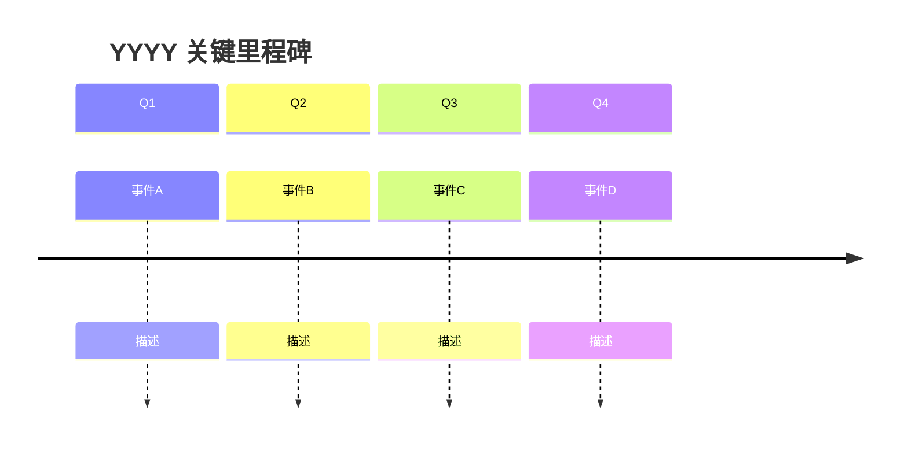
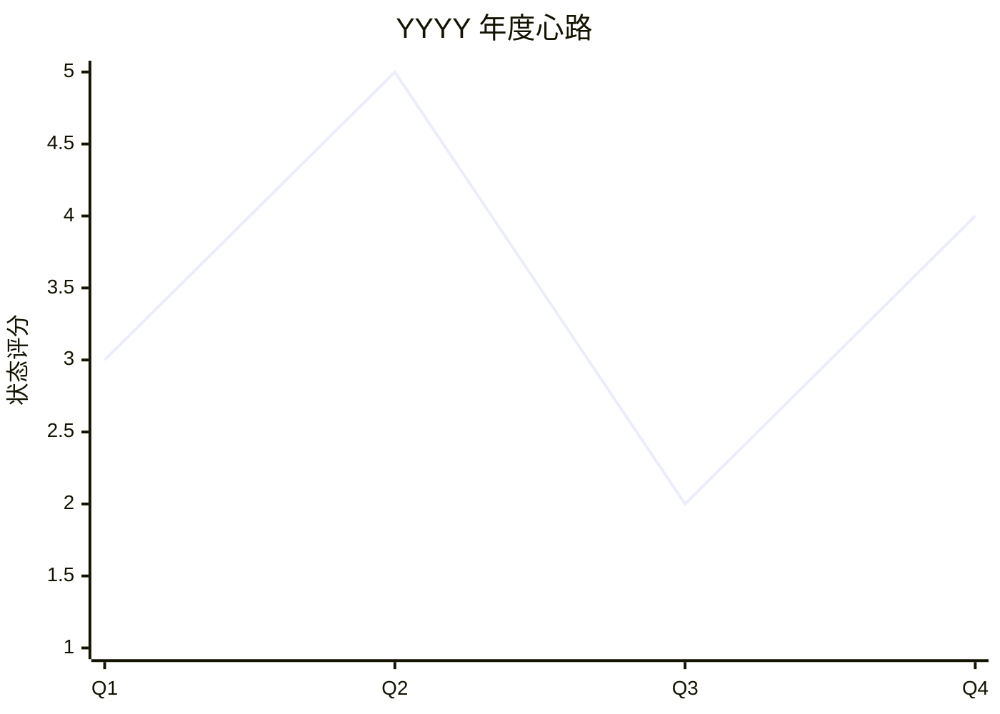

# Yearly Summary

## 适用范围

- 数据源固定为飞书云空间（folder token 配置在 `../summary-shared/lark_folders.json`）。
- 默认结构：根目录下 `daliy/`、`weekly/`、`monthly/` 三个文件夹；年报与历史年报直接放在根目录（没有专门的 yearly 子文件夹）。每篇日报/周报/月报/年报都是飞书 `docx` 文档（不是本地 Markdown）。
- 文件名约定：日报 `M.D-YY`（如 `5.5-26`）、周报 `M.DD～M.DD-YY`（日两位补零，如 `3.09～3.15-26`）、月报 `M月-YY`（如 `3月-26`）、年报 `YYYY年`（如 `2025年`）。
- 用户若指定了不同的飞书文件夹结构，先确认 folder token 是否更新到 `lark_folders.json`，再继续执行。

## 工作流

1. 解析年份
- 如果用户明确给出年份（如 `2025`），直接使用。
- 如果用户说"今年"，使用当前年份。
- 如果用户说"去年"，使用上一年份。
- 优先使用脚本生成标准年份窗口：

```bash
python scripts/year_window.py --which current
python scripts/year_window.py --which last
python scripts/year_window.py --which explicit --year 2025
```

2. 扫描飞书 daily/weekly/monthly/根目录
- 用 `scripts/collect_lark_year_notes.py` 一次性拿到：
  - 当年 12 个月的月报命中情况 `existing_monthly_files`（每项含 `month` / `name` / `token` / `url`）
  - 缺失月份 `missing_months`
  - 跨入/跨出当年的全部周报 `existing_weekly_files`
  - 每月日报覆盖率 `daily_coverage_by_month`、最密集月 `daily_densest_month`、最稀疏月 `daily_sparsest_month`、全年覆盖率 `total_daily_coverage`
  - 目标年报文件名 `yearly_output_basename`（如 `2025年`）、是否已存在 `yearly_output_exists`
  - 上一年年报 `style_reference_files.yearly_files`（位于根目录，作风格参考）
- 示例：

```bash
python scripts/collect_lark_year_notes.py --year 2025
```

- 该脚本读取 `../summary-shared/lark_folders.json` 获取 folder token，禁止把 token 硬编码到任何地方。

3. 读取并提炼证据（三层数据策略）
- **月报（主框架）**：先用 `lark-cli docs +fetch --doc <url>` 读取 `existing_monthly_files` 中所有月报的 markdown 内容（飞书返回值在 `data.markdown`），提炼全年主线、精力分布、里程碑等结构性信息。月报是已经过一次提炼的高密度证据，是年报最主要的来源。
- **周报（补充细节）**：始终读取 `existing_weekly_files` 中全部周报，不只是月报缺失时才回退。周报保留了月报中可能被过滤的具体事件、情绪、小时刻，是"年度心路""致自己""成长与蜕变"等章节的重要素材来源。
- **日报（最终回退）**：仅在某月月报和周报都缺失时，才到 daily 文件夹定向找补。**禁止逐篇读 365 篇日报**，会浪费上下文。
- **跨年衔接**：如果上一年年报存在（`style_reference_files.yearly_files[0]`），用 `docs +fetch` 读取其"新年展望"章节，在本年"主线回顾"中自然呼应——哪些去年的愿景实现了、哪些调整了、哪些放弃了。
- **飞书 → markdown 注意事项**：`docs +fetch` 返回值在 `data.markdown`。历史月报/年报里的图表章节会显示 `<whiteboard token="..." align="left"/>` 标签——代表那是一张飞书画板，文字内容看不到，但不影响阅读其他章节。
- 提炼时采用**回顾性叙事思维**，回答以下问题：
  - 这一年推动了哪几条主线？各主线跨越了哪些月份？经历了什么转折？（主线回顾）
  - 精力整体花在哪几个方向？哪些项目时间跨度最长？（精力全景）
  - 全年最关键的里程碑和转折点是什么？（里程碑时间线）
  - 全年的情绪起伏、高光与低谷分别在什么时候？因为什么？（年度心路）
  - 年初的自己和年末的自己，在技能、认知、习惯上有什么变化？（成长与蜕变）
  - 全年的数据画像是什么样的？（年度数据）
  - 想对自己说什么？（致自己）
  - 明年想做什么？（新年展望）

4. 格式与风格规则
- 文件名使用 `yearly_output_basename`（如 `2025年`），不带 `.md` 扩展名（飞书 docx 不需要）。
- **不写 Markdown frontmatter**（飞书 docx 不支持，写了也不会被保留）。
- 正文从 `# 年度一句话` 开始，不重复文件名/标题。
- 读取上一年年报（如有），仅借鉴句式和篇幅密度，不继承旧事实。
- **文风特殊规则**：年总结不同于周/月报的任务导向文风。
  - **允许并鼓励第一人称**：可以用"我"，可以写感受、感悟、自我对话。
  - **允许感性表达**：可以幽默、可以抒情、可以坦诚地写困惑和迷茫。
  - **像写给年末的自己的一封信**，不像写给老板的汇报。
  - 但仍需基于日报/周报/月报证据，不杜撰事实。

5. 生成年总结内容
- 以 `references/yearly-summary-template.md` 为结构骨架，不机械套用。
- 严格基于原始月报/周报/日报，不杜撰结论。
- 术语尽量沿用原文，保持项目语境一致。

**反公式化原则（贯穿全文）：**
- 年总结是全年中最个性化的一篇文档。模板是骨架，不是填空题。
- 章节可以根据实际内容增减、合并、调整顺序。如果某个章节当年没有内容支撑，可以跳过。
- 图表是增强理解的工具，不是装饰。如果某张图表在当年数据下没有意义（如只有 3 个月的月报），可以省略。
- 每年的年总结应该有不同的气质，反映当年的真实面貌。

### 5.1 内容结构（10 个一级章节）

按以下顺序输出。**正文从第一个 `#` 章节开始**，不写 frontmatter、不重复文件名。每个 `#` 章节结束后插入 `---` 分隔线，最后一节不加。

**`# 年度一句话`**
- 用一句话定调全年。
- 用 Markdown 引用语法 `>` 呈现。
- 示例：`> 从"边学边做"到"有体系地推进"，这一年的关键词是收敛。`

**`# 年度关键词`**
- 提炼 3~5 个最能代表这一年的词或短语。
- 用 `**粗体**` 呈现，一行排列，用 `｜` 分隔。
- 示例：`**收敛** ｜ **代码重构** ｜ **论文交付** ｜ **工具链觉醒**`

**`# 精力全景`**
- 包含两张图表，**均用飞书画板（whiteboard）呈现**，不要在 markdown 里写 mermaid 代码块。导入主体 markdown 时该章节正文留空（仅有标题），两块画板由步骤 6 的后处理流程通过 `lark-cli whiteboard +update` 写入（mermaid 作为输入格式）。
  1. **饼图**：全年精力在各大方向上的粗略百分比。主题 3~6 个。把内容暂存为 `./pie.mmd`。
  2. **甘特图**：主要项目/主线的时间跨度，按月显示哪些事在什么时段推进。把内容暂存为 `./gantt.mmd`。
- 图表后可加 1~2 段文字简要解读趋势（这部分文字写在 markdown 主体里，不进画板）。

饼图源码格式（写入 `./pie.mmd`）：
````md

```mermaid
pie title YYYY 年度精力分布
    "主题A" : 40
    "主题B" : 30
    "主题C" : 20
    "其他" : 10
```
````

甘特图源码格式（写入 `./gantt.mmd`）：
````md

```mermaid
gantt
    title YYYY 年度项目时间线
    dateFormat YYYY-MM
    section 主线A
    项目描述 :2025-01, 2025-06
    section 主线B
    项目描述 :2025-03, 2025-12
```
````

**`# 主线回顾`**
- **年报最核心的章节**，必须体现跨月或跨季度的变化弧线。
- 每条主线是一个独立的二级标题（`##`），用能概括全年变化的短语命名。
- 每条主线下用叙事段落讲清楚：年初是什么状态 → 中间经历了什么转折 → 年末到了什么阶段。
- 叙事方式灵活：可以按时间线、按问题→解决、按阶段跃迁。不要每条主线都用同一种写法。
- **✅**标记可选：当主线有明确的年度性成果时使用。
- 主线数量按实际内容决定，通常 2~5 条。

**`# 里程碑时间线`**
- 按季度排列全年关键节点，**用飞书画板（whiteboard）呈现 timeline 图**。导入主体 markdown 时该章节正文留空（仅有标题），画板由步骤 6 的后处理流程通过 `lark-cli whiteboard +update` 写入。
- 把内容暂存为 `./timeline.mmd` 作为后处理输入。
- 图表后可用简短文字补充图表中无法展开的细节（这部分文字写在 markdown 主体里）。

timeline 源码格式（写入 `./timeline.mmd`）：
````md

```mermaid
timeline
    title YYYY 关键里程碑
    section Q1
        事件A : 描述
    section Q2
        事件B : 描述
    section Q3
        事件C : 描述
    section Q4
        事件D : 描述
```
````

**`# 年度心路`**
- 用 `xychart-beta` 折线图可视化全年情绪/状态起伏（季度 × 1~5 分）。**用飞书画板（whiteboard）呈现**，导入主体 markdown 时该章节正文留空（仅有标题），画板由步骤 6 的后处理流程通过 `lark-cli whiteboard +update` 写入。
- 把内容暂存为 `./xychart.mmd` 作为后处理输入。
- 图表后用 1~3 段叙事讲述高光和低谷背后的故事（这部分文字写在 markdown 主体里）。
- 这个章节允许最多的感性表达：困惑、焦虑、成就感、释然都可以写。
- 注：早期模板曾使用 `journey` 图，但飞书画板 mermaid 路径不支持 `journey`，已改用 `xychart-beta`——Q1~Q4 为 x 轴，1~5 分为 y 轴，效果更清晰。

xychart-beta 源码格式（写入 `./xychart.mmd`）：
````md

```mermaid
xychart-beta
    title "YYYY 年度心路"
    x-axis [Q1, Q2, Q3, Q4]
    y-axis "状态评分" 1 --> 5
    line [3, 5, 2, 4]
```
````

**`# 成长与蜕变`**
- 对比年初和年末的自己，从以下维度展开（按实际情况选取，不必全覆盖）：
  - 技能：新学会了什么？哪些技能从生疏到熟练？
  - 认知：对研究/工作/生活的理解有什么变化？
  - 习惯：建立了什么新习惯？改掉了什么旧习惯？
  - 工具：工作流/工具链有什么升级？
- 可以用对比式写法，也可以用叙事式。

**`# 年度数据`**
- 用 Markdown 表格呈现全年数据画像：

```md
| 指标 | 数值 |
|------|------|
| 日报总数 | {{existing}}/{{total}} ({{rate}}%) |
| 月报完成 | {{count}}/12 |
| 周报总数 | {{count}} 篇 |
| 日报最密集月 | {{month}} ({{count}} 篇) |
| 日报最稀疏月 | {{month}} ({{count}} 篇) |
```

- 数据来自 `collect_lark_year_notes.py` 的输出，不需要猜测。
- 可以在表格后加一句话点评数据趋势。

**`# 致自己`**
- 这是年总结中最"人"的部分。
- 可以写：感悟、致谢（导师、同学、工具、自己）、自我对话、未说出口的话。
- 没有固定格式：可以是一段话、几个短句、一封短信、甚至一首打油诗。
- 唯一要求：真诚。

**`# 新年展望`**
- 面向下一年的方向和期待。
- 用 checkbox 格式，不加优先级标签（年度展望不需要 P1/P2 的精确排序）。
- 每项可附带简短的期待或完成标准。
- 通常 3~6 项。

```md
- [ ] {{方向}} — {{期待/标准}}
```

### 5.2 去日期化规则

- 正文中禁止以精确日期开头叙事。不得出现 `` `2025-07-15` 完成了…… `` 这类写法。
- 叙事以主线、事件和转折为锚点，使用模糊时间表述："年初""春天""年中""下半年""入秋后""年末"。
- 唯一例外：里程碑时间线图表中可使用季度标记（Q1/Q2/Q3/Q4）。

### 5.3 可视化与排版规则

- **每个 `#` 章节结束后插入 `---` 分隔线**，最后一个章节末尾不加。
- 使用加粗前缀标记增强视觉层次（可选，按需使用）：
  - `**✅**`：年度性成果、重大里程碑
  - `**⚠️**`：踩坑、风险回顾
  - `**💡**`：正面经验、顿悟时刻
  - `**📌**`：致自己章节中的引用或感悟
- 全年共 4 张图表，**全部用飞书画板渲染**（步骤 6 后处理），markdown 主体里不写 mermaid 代码块：
  - 精力全景：pie + gantt（2 张），源码分别存为 `./pie.mmd`、`./gantt.mmd`
  - 里程碑时间线：timeline（1 张），源码存为 `./timeline.mmd`
  - 年度心路：xychart-beta（1 张），源码存为 `./xychart.mmd`
- 所有 mermaid 源码遵循 `lark-whiteboard` skill 支持的图表类型与语法规则。
- 新年展望使用 `- [ ]` checkbox。
- 若月报覆盖率低于 50%，在年度数据章节后用以下格式说明，不扩展推断：

```md
> 本年月报覆盖率：5/12 (42%)。缺失月份：6月、7月、8月、9月、10月、11月、12月。结论仅供参考。
```

6. 写回飞书年报
- 输出步骤：
  1. 在临时目录生成 markdown 文件，文件名为 `<yearly_output_basename>.md`（如 `2025年.md`）。**markdown 中不要写 mermaid 代码块**——`# 精力全景`、`# 里程碑时间线`、`# 年度心路` 三个章节的图表正文留空（标题下直接接配套的解读文字或 `---` 分隔线），4 块画板会在 import 后通过后处理写入。
  2. 检查 `yearly_output_exists`：
     - 若为 false，直接执行步骤 3。
     - 若为 true，**未经用户明确允许，不要覆盖**。改用 `yearly_output_basename_v2`（即 `<basename>_v2`）作为目标文件名，并在最终回复里告知用户。
  3. 上传成 docx，注意写入的是**根目录**（`yearly_folder_token` = `root_folder_token`）：

```bash
lark-cli drive +import --type docx \
  --file ./<basename>.md \
  --folder-token <yearly_folder_token> \
  --name <output_basename>
# 记下返回的 data.url 作为 DOC_URL
```

  4. 在 4 个图表锚点章节后分别插入空白画板，拿到各自的 board_token。**注意 `insert_after --selection-by-title` 是"紧跟在标题块之后"插入，连续两次插入同一标题会让后插入的画板出现在前面**——所以"精力全景"一节需要按"先 gantt 后 pie"的顺序调用，最终顺序自然是 pie → gantt：

```bash
# 精力全景：先插入 gantt 画板（会落在标题正后）
lark-cli docs +update --doc <DOC_URL> --mode insert_after \
  --selection-by-title "# 精力全景" \
  --markdown '<whiteboard type="blank"></whiteboard>'
# data.board_tokens[0] → WB_GANTT_TOKEN

# 精力全景：再插入 pie 画板（紧跟标题，把 gantt 推到下面）
lark-cli docs +update --doc <DOC_URL> --mode insert_after \
  --selection-by-title "# 精力全景" \
  --markdown '<whiteboard type="blank"></whiteboard>'
# data.board_tokens[0] → WB_PIE_TOKEN
# 此时文档顺序：# 精力全景 → pie → gantt → 解读文字

# 里程碑时间线
lark-cli docs +update --doc <DOC_URL> --mode insert_after \
  --selection-by-title "# 里程碑时间线" \
  --markdown '<whiteboard type="blank"></whiteboard>'
# data.board_tokens[0] → WB_TIMELINE_TOKEN

# 年度心路
lark-cli docs +update --doc <DOC_URL> --mode insert_after \
  --selection-by-title "# 年度心路" \
  --markdown '<whiteboard type="blank"></whiteboard>'
# data.board_tokens[0] → WB_XYCHART_TOKEN
```

  5. 把第 5.1 节准备好的 4 个 mermaid 文件依次写入对应画板：

```bash
lark-cli whiteboard +update --whiteboard-token <WB_PIE_TOKEN> \
  --input_format mermaid --source @./pie.mmd \
  --idempotent-token "wb-pie-$(date +%s)" --overwrite --yes --as user

lark-cli whiteboard +update --whiteboard-token <WB_GANTT_TOKEN> \
  --input_format mermaid --source @./gantt.mmd \
  --idempotent-token "wb-gantt-$(date +%s)" --overwrite --yes --as user

lark-cli whiteboard +update --whiteboard-token <WB_TIMELINE_TOKEN> \
  --input_format mermaid --source @./timeline.mmd \
  --idempotent-token "wb-timeline-$(date +%s)" --overwrite --yes --as user

lark-cli whiteboard +update --whiteboard-token <WB_XYCHART_TOKEN> \
  --input_format mermaid --source @./xychart.mmd \
  --idempotent-token "wb-xychart-$(date +%s)" --overwrite --yes --as user
```

  6. 验证最终 doc URL 与 4 个 board_token，写入临时记录中。

- 整套流程把"主体内容"和"画板内容"解耦：主体走 `drive +import`，4 张图走 `lark-whiteboard` skill 的官方路径。
- `journey` 不在 whiteboard-cli 支持的 mermaid 类型中，所以"年度心路"统一改用 `xychart-beta`。
- 不要使用 `docs +update` 改写已有 docx 主体，用 `+import` 创建新文档保证主体格式正确。

7. 结果回传给用户
- 返回新生成的飞书年报 URL。
- 列出纳入的月报数量与缺失月份。
- 列出全年日报覆盖率（如 `265/365 (72.6%)`）和最密集/最稀疏月。
- 列出纳入的周报篇数。
- 列出 4 个画板 token（`WB_PIE_TOKEN` / `WB_GANTT_TOKEN` / `WB_TIMELINE_TOKEN` / `WB_XYCHART_TOKEN`），方便用户后续编辑/查看。
- 若发生覆盖规避，明确说明最终写入的文件名。

## 执行细节

1. 飞书文件命名规则
- 日报：`M.D-YY`（不补零，如 `5.5-26`、`4.30-26`）。
- 周报：`M.DD～M.DD-YY`（日补零，如 `3.09～3.15-26`、`4.20～4.26-26`）。
- 月报：`M月-YY`（如 `3月-26`）。
- 年报：`YYYY年`（如 `2025年`）。
- 这些规则已编码在 `collect_lark_year_notes.py` 与 `year_window.py` 中，不要在 SKILL.md 之外手动拼接。

2. 数据层级
- 月报是年报的结构性主框架来源（主线、精力、里程碑）。
- 周报始终作为补充细节来源（情绪、小事件、具体感受），不只是回退。
- 日报仅在月报和周报都缺失时才读，且只读对应缺失月份的日报，不全年遍历。
- 三层数据各有不同用途：月报看"全年脉络"，周报看"生活质感"，日报看"原始记录"。

3. 跨年场景
- 周报跨年是正常情况（如 `12.29～1.4-26` 跨 2025 和 2026）。`collect_lark_year_notes.py` 已自动包含跨年周报，不需要特殊处理。
- 上一年年报与当年年报都在根目录下；通过文件名（`(year-1)年` vs `YYYY年`）区分。

4. 完整性检查
- 交付前必须报告月报覆盖率（如 `6/12`）和日报覆盖率。
- 如果月报覆盖率低于 50%，应在年报中明确说明数据基础有限，结论仅供参考。

5. 配置与权限
- folder token 集中放在 `../summary-shared/lark_folders.json`，三个 summary skill 共用。
- `yearly_folder_token` 与 `root_folder_token` 默认相同（年报直接落在根目录）。
- 修改飞书数据源（如换文件夹）时，只需修改这一个文件。
- 调用 `lark-cli` 前确保已登录（`lark-cli auth login`）；若返回 `permission denied`，提示用户检查身份。

## 资源

- `scripts/year_window.py`: 解析年份，输出标准日期范围、年报标题、文件名候选。
- `scripts/collect_lark_year_notes.py`: 通过 `lark-cli` 扫描飞书 daily/weekly/monthly/根目录，返回月报命中、跨年周报、日报覆盖率、目标年报文件名、上一年年报。
- `references/yearly-summary-template.md`: 年报模板骨架（无 frontmatter，无 mermaid 代码块）。
- `lark-whiteboard` skill: 4 张图表的画板写入路径，本 skill 第 6 步直接复用其 `whiteboard +update` 流程。
- `../summary-shared/lark_folders.json`: 共享 folder token 配置。
